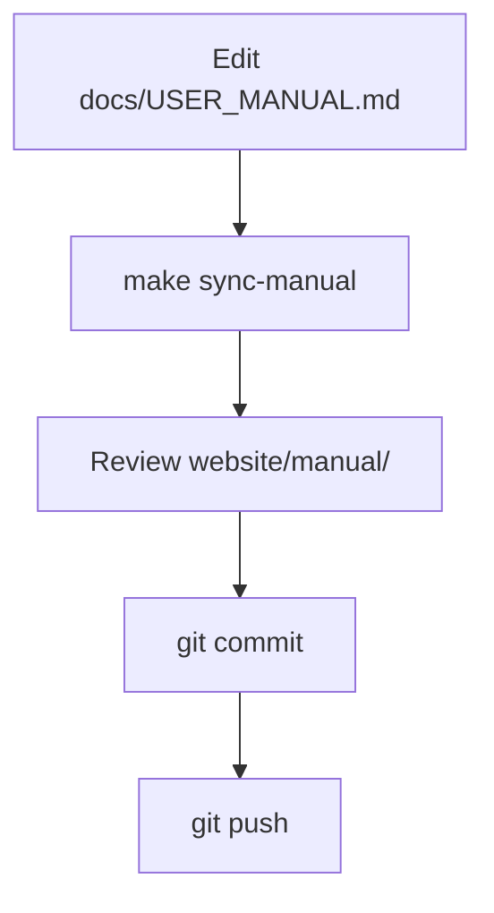
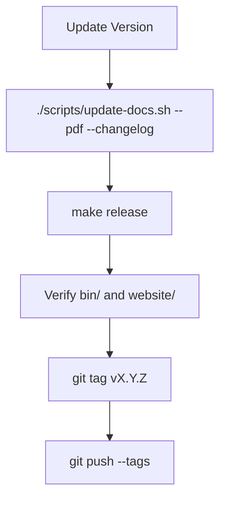
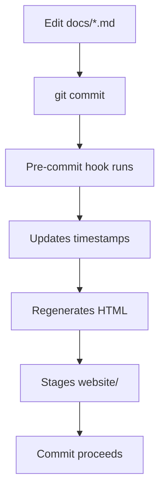

# Build Workflow Integration - Summary

**Date**: 2025-11-06
**Status**: ✅ Complete

## Overview

Successfully integrated the manual sync script into the HelixCode build workflow. The system now provides automated documentation management with multiple integration points for developers.

## What Was Created

### 1. Scripts Created

| Script | Location | Purpose |
|--------|----------|---------|
| `sync-manual.sh` | `/scripts/sync-manual.sh` | Syncs user manual to website, converts to HTML |
| `update-docs.sh` | `/scripts/update-docs.sh` | Master documentation script (HTML, PDF, changelog) |
| `build.sh` | `/scripts/build.sh` | Comprehensive build script with doc integration |
| `pre-commit.template` | `/scripts/pre-commit.template` | Optional git hook for auto-sync |

### 2. Makefile Targets Added

```makefile
# Documentation Targets
make sync-manual     # Sync manual to website
make manual-html     # Convert Markdown to HTML only
make docs            # Build all documentation
make release         # Full release (clean + assets + docs + build + test)

# Modified Targets
make assets          # Now includes logo-assets + sync-manual
```

### 3. Documentation Created

| File | Location | Purpose |
|------|----------|---------|
| `CONTRIBUTING.md` | `/docs/CONTRIBUTING.md` | Complete guide for updating documentation |
| `README.md` | `/scripts/README.md` | Scripts directory documentation |
| `BUILD_INTEGRATION_SUMMARY.md` | Root | This summary document |

## Makefile Targets

### Documentation Targets

```bash
# Quick manual sync
make sync-manual

# Convert Markdown to HTML only
make manual-html

# Build all documentation
make docs

# Full release build
make release
```

### Build Integration Points

1. **Pre-Build Hook**: Documentation regenerated in `make release`
2. **Asset Generation**: `make assets` includes documentation sync
3. **Manual Override**: Can skip docs with build script flags

## How Developers Update the Manual

### Quick Update (Most Common)

```bash
# 1. Edit the manual
vim docs/USER_MANUAL.md

# 2. Sync to website
make sync-manual

# 3. Commit
git add docs/ website/
git commit -m "docs: update user manual"
```

### Full Documentation Update

```bash
# With all features (PDF + changelog)
./scripts/update-docs.sh --pdf --changelog

# Basic update (HTML only)
./scripts/update-docs.sh
```

### Using Pre-Commit Hook (Optional)

```bash
# One-time setup
cp scripts/pre-commit.template .git/hooks/pre-commit
chmod +x .git/hooks/pre-commit

# Then just commit - docs auto-update
git commit -m "docs: update manual"
# Hook automatically:
# - Updates timestamps
# - Regenerates HTML
# - Stages website files
```

## Commands to Run

### For Documentation Only

```bash
# Sync manual to website
make sync-manual

# Convert to HTML
make manual-html

# Full documentation build
make docs

# Master update script (with options)
./scripts/update-docs.sh
./scripts/update-docs.sh --pdf
./scripts/update-docs.sh --pdf --changelog
```

### For Building

```bash
# Standard build (includes docs)
make build

# Build with docs explicitly
make docs build

# Build without docs
./scripts/build.sh --no-docs

# Build with tests
./scripts/build.sh --with-tests

# Full release
make release
```

### For Testing

```bash
# Test just the sync
make sync-manual
open website/manual/index.html

# Test full docs
make docs
ls -la website/

# Test release build
make release
ls -la bin/
```

## Workflow Integration

### Standard Developer Workflow



### Release Workflow



### Pre-Commit Hook Workflow



## File Structure

```
HelixCode/
├── Makefile                          # Updated with doc targets
├── BUILD_INTEGRATION_SUMMARY.md     # This file
├── docs/
│   ├── USER_MANUAL.md               # Source documentation
│   ├── USER_GUIDE.md
│   ├── API_REFERENCE.md
│   └── CONTRIBUTING.md              # ✨ New: How to update docs
├── scripts/
│   ├── README.md                    # ✨ New: Scripts documentation
│   ├── sync-manual.sh               # ✨ New: Sync script
│   ├── update-docs.sh               # ✨ New: Master doc script
│   ├── build.sh                     # ✨ New: Build script
│   ├── pre-commit.template          # ✨ New: Git hook template
│   ├── run-tests.sh
│   ├── run-all-tests.sh
│   └── run-docker-tests.sh
└── website/                          # Generated website files
    ├── manual/
    │   ├── index.html               # Generated landing page
    │   ├── USER_MANUAL.html         # Generated HTML
    │   ├── USER_MANUAL.md           # Synced Markdown
    │   ├── style.css                # Generated CSS
    │   └── .sync-metadata.json      # Sync metadata
    ├── guides/                      # Additional guides
    ├── pdf/                         # PDF versions (optional)
    └── .doc-metadata.json           # Documentation metadata
```

## Generated Files

### On `make sync-manual`:

- `website/manual/USER_MANUAL.md` - Copy of source
- `website/manual/USER_MANUAL.html` - HTML version
- `website/manual/index.html` - Landing page
- `website/manual/style.css` - Stylesheet
- `website/manual/.sync-metadata.json` - Sync info

### On `./scripts/update-docs.sh --pdf --changelog`:

All of the above, plus:
- `website/pdf/HelixCode_User_Manual.pdf` - PDF version
- `CHANGELOG.md` - Updated with doc changes
- `website/.doc-metadata.json` - Full metadata

## Prerequisites

### Required

- Go 1.24.0+
- Git
- Bash (macOS/Linux)

### Optional (for full features)

```bash
# For HTML/PDF conversion
brew install pandoc  # macOS
sudo apt-get install pandoc  # Linux

# For PDF generation
brew install basictex  # macOS
sudo apt-get install texlive-xetex  # Linux
```

## Testing

### Test Manual Sync

```bash
make sync-manual
open website/manual/index.html
```

### Test Full Documentation

```bash
make docs
ls -la website/
```

### Test Build Integration

```bash
make release
ls -la bin/
```

### Test Pre-Commit Hook

```bash
# Install hook
cp scripts/pre-commit.template .git/hooks/pre-commit
chmod +x .git/hooks/pre-commit

# Make a doc change
echo "# Test" >> docs/USER_MANUAL.md

# Commit (hook should run)
git add docs/USER_MANUAL.md
git commit -m "test: hook"
```

## Key Features

### 1. Automatic Timestamp Updates

All Markdown files get automatic "Last Updated" date updates:
- `USER_MANUAL.md`
- `USER_GUIDE.md`
- `API_REFERENCE.md`
- `ARCHITECTURE.md`

### 2. Multi-Format Output

- **Markdown**: Source format
- **HTML**: With styling and table of contents
- **PDF**: Optional, requires pandoc + LaTeX

### 3. Sync Metadata

Each sync generates metadata:
```json
{
  "last_sync": "2025-11-06T08:00:00Z",
  "source": "/path/to/USER_MANUAL.md",
  "version": "2.0",
  "sync_script": "sync-manual.sh"
}
```

### 4. Flexible Integration

- **Make targets**: For quick commands
- **Direct scripts**: For advanced options
- **Build integration**: Automatic in release
- **Pre-commit hook**: Optional automation

### 5. Build Information

Each build creates metadata:
```json
{
  "version": "1.0.0",
  "build_time": "2025-11-06_08:00:00",
  "git_commit": "abc123",
  "platform": "all",
  "docs_built": true,
  "tests_run": true
}
```

## CI/CD Integration

### GitHub Actions Example

```yaml
name: Build and Documentation

on: [push, pull_request]

jobs:
  build:
    runs-on: ubuntu-latest
    steps:
      - uses: actions/checkout@v2

      - name: Setup Go
        uses: actions/setup-go@v2
        with:
          go-version: 1.24.0

      - name: Install pandoc
        run: sudo apt-get install -y pandoc

      - name: Build Documentation
        run: make docs

      - name: Build Application
        run: make build

      - name: Run Tests
        run: make test

      - name: Create Release
        if: startsWith(github.ref, 'refs/tags/')
        run: make release
```

## Troubleshooting

### Issue: pandoc not found

```bash
# Install pandoc
brew install pandoc  # macOS
sudo apt-get install pandoc  # Linux
```

### Issue: HTML not updating

```bash
# Clear and regenerate
rm -rf website/manual/*
make sync-manual
```

### Issue: Pre-commit hook not running

```bash
# Ensure executable
chmod +x .git/hooks/pre-commit

# Test manually
.git/hooks/pre-commit
```

## Next Steps

### For Developers

1. Read `docs/CONTRIBUTING.md` for detailed guidelines
2. Install the pre-commit hook (optional)
3. Try updating the manual: `vim docs/USER_MANUAL.md`
4. Test the sync: `make sync-manual`
5. Review output: `open website/manual/index.html`

### For CI/CD

1. Add `make docs` to build pipeline
2. Add `make release` for release builds
3. Archive `website/` as artifacts
4. Deploy `website/` to hosting

### For Release Managers

1. Update version in `Makefile`
2. Run `./scripts/update-docs.sh --pdf --changelog`
3. Run `make release`
4. Verify artifacts in `bin/` and `website/`
5. Tag and push: `git tag vX.Y.Z && git push --tags`

## Documentation Locations

- **Source**: `/docs/*.md`
- **Website**: `/website/`
- **Build Scripts**: `/scripts/`
- **Contributing Guide**: `/docs/CONTRIBUTING.md`
- **Scripts Documentation**: `/scripts/README.md`

## Quick Command Reference

```bash
# Documentation
make sync-manual              # Quick sync
make docs                     # Build all docs
./scripts/update-docs.sh      # Master script

# Building
make build                    # Build app
make release                  # Full release

# Testing
make test                     # Run tests
./scripts/build.sh --with-tests  # Build + test

# Help
make help                     # Show all targets
./scripts/update-docs.sh --help  # Script help
./scripts/build.sh --help     # Build script help
```

## Success Criteria ✅

- ✅ `sync-manual.sh` created and executable
- ✅ `update-docs.sh` created with full features
- ✅ `build.sh` created with doc integration
- ✅ Makefile updated with doc targets
- ✅ `CONTRIBUTING.md` created with full guide
- ✅ Pre-commit hook template created
- ✅ Scripts documented in `scripts/README.md`
- ✅ All scripts tested and working
- ✅ Integration points documented
- ✅ Developer workflow documented

## Support

For questions or issues:
- Review `docs/CONTRIBUTING.md`
- Check `scripts/README.md`
- Open a GitHub issue

---

**Integration Complete**: 2025-11-06
**Version**: 1.0.0
**Status**: Production Ready ✅
