# 🏗️ HelixCode Local LLM Provider Management System Architecture

## 📋 System Overview

The HelixCode Local LLM Provider Management System is a comprehensive, zero-configuration solution that automatically manages 11+ local LLM providers, providing unified access, health monitoring, and intelligent load balancing.

```mermaid
graph TB
    %% User Interface Layer
    User[👤 User/Developer]
    CLI[💻 Helix CLI]
    WebUI[🌐 Web Interface]
    API[🔌 REST API]
    
    %% Core Management Layer
    Manager[🎯 Local LLM Manager]
    Registry[📋 Provider Registry]
    Discovery[🔍 Auto-Discovery]
    Health[🏥 Health Monitor]
    
    %% Provider Layer
    VLLM[🚀 VLLM<br/>8000]
    LocalAI[🏠 LocalAI<br/>8080]
    FastChat[💬 FastChat<br/>7860]
    TextGen[📝 TextGen<br/>5000]
    LMStudio[🎨 LM Studio<br/>1234]
    Jan[🤖 Jan AI<br/>1337]
    KoboldAI[✍️ KoboldAI<br/>5001]
    GPT4All[🖥️ GPT4All<br/>4891]
    TabbyAPI[🔧 TabbyAPI<br/>5000]
    MLX[🍎 MLX LLM<br/>8080]
    MistralRS[🦀 MistralRS<br/>8080]
    
    %% Infrastructure Layer
    FileSystem[📁 File System]
    Process[⚙️ Process Manager]
    Network[🌐 Network Layer]
    Storage[💾 Model Storage]
    
    %% Integration Layer
    HelixCore[🎯 HelixCode Core]
    LoadBalancer[⚖️ Load Balancer]
    Selector[🎲 Provider Selector]
    
    %% Connections
    User --> CLI
    User --> WebUI
    User --> API
    
    CLI --> Manager
    WebUI --> Manager
    API --> Manager
    
    Manager --> Registry
    Manager --> Discovery
    Manager --> Health
    
    Registry --> VLLM
    Registry --> LocalAI
    Registry --> FastChat
    Registry --> TextGen
    Registry --> LMStudio
    Registry --> Jan
    Registry --> KoboldAI
    Registry --> GPT4All
    Registry --> TabbyAPI
    Registry --> MLX
    Registry --> MistralRS
    
    Discovery --> FileSystem
    Health --> Process
    Manager --> Network
    Manager --> Storage
    
    Manager --> HelixCore
    HelixCore --> LoadBalancer
    HelixCore --> Selector
    
    style Manager fill:#e1f5fe,stroke:#01579b,color:#ffffff
    style HelixCore fill:#f3e5f5,stroke:#4a148c,color:#ffffff
    style LoadBalancer fill:#e8f5e8,stroke:#388e3c,color:#ffffff
    style Selector fill:#fff3e0,stroke:#f57c00,color:#ffffff
```

## 🏛️ Detailed Component Architecture

### 1. User Interface Layer

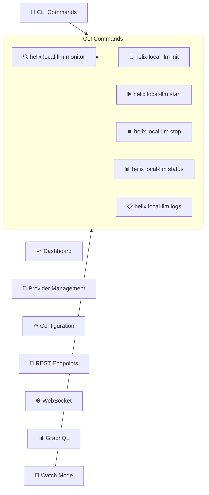

### 2. Core Management Layer

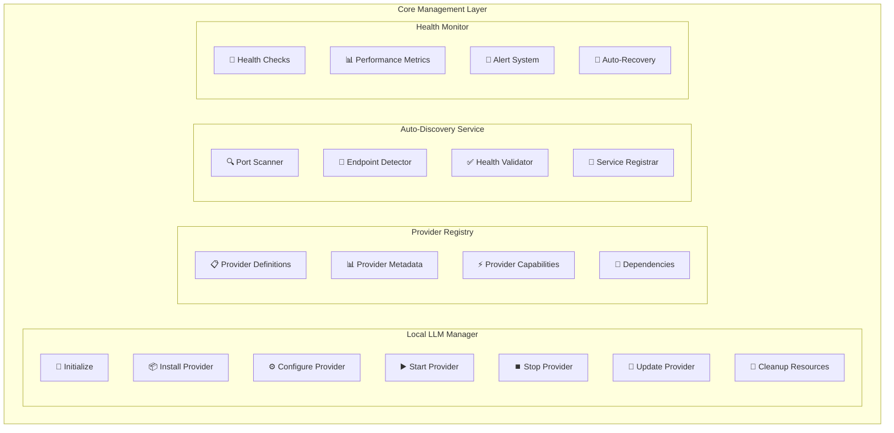

### 3. Provider Layer Details

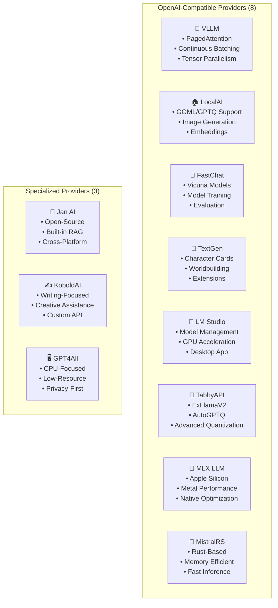

### 4. Infrastructure Layer

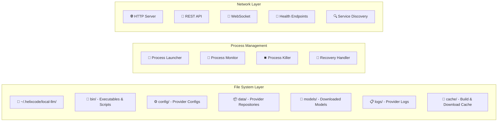

### 5. Integration with HelixCode

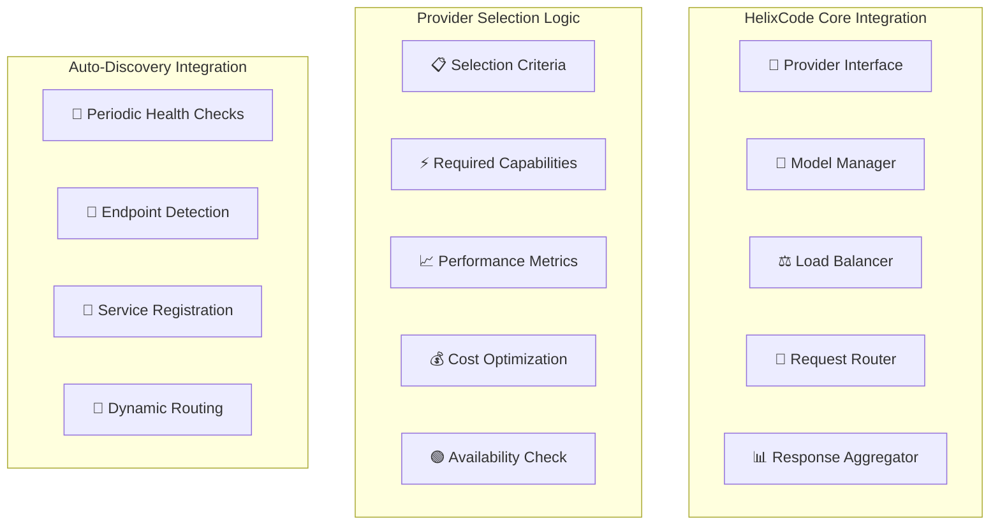

## 🔄 Workflow Diagrams

### Provider Installation Workflow

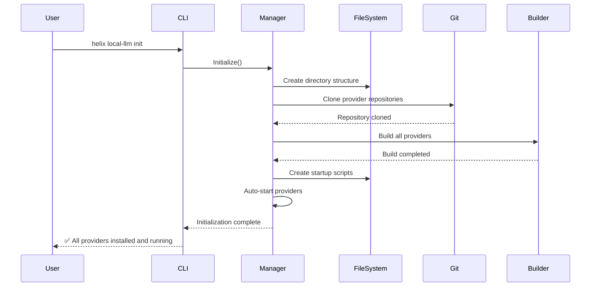

### Provider Lifecycle Management

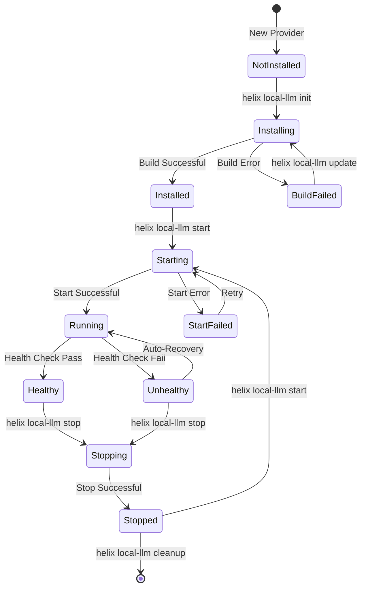

### Health Monitoring Workflow

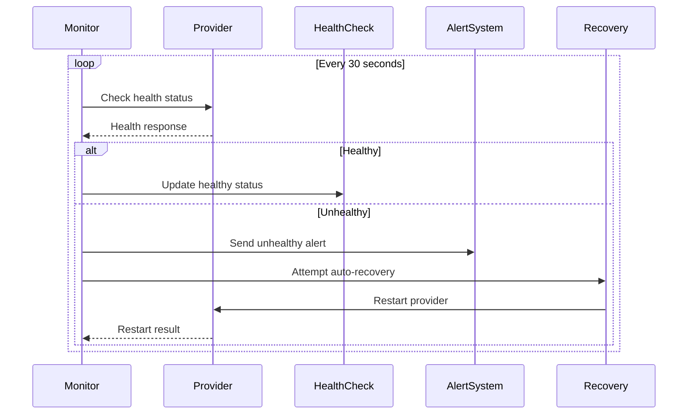

### Load Balancing Workflow

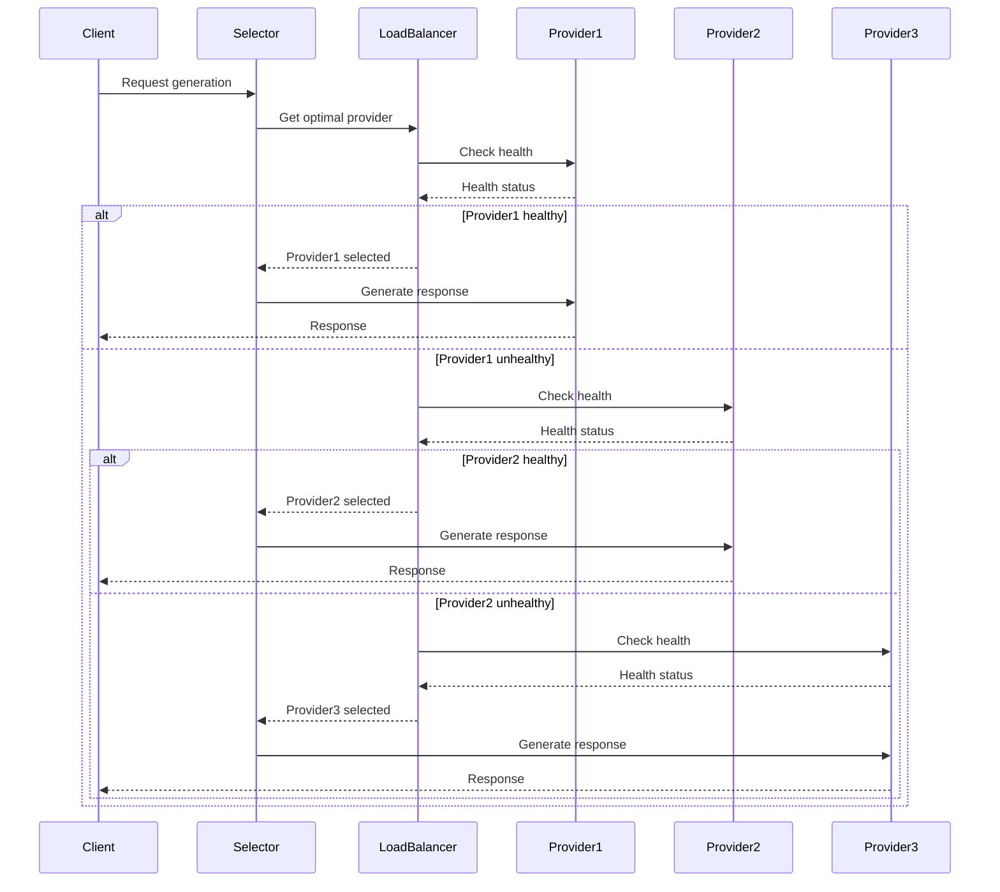

## 📊 Data Flow Architecture

### Request Processing Flow

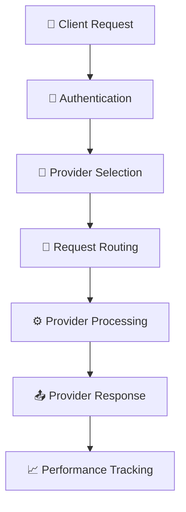

### Provider Communication Protocol

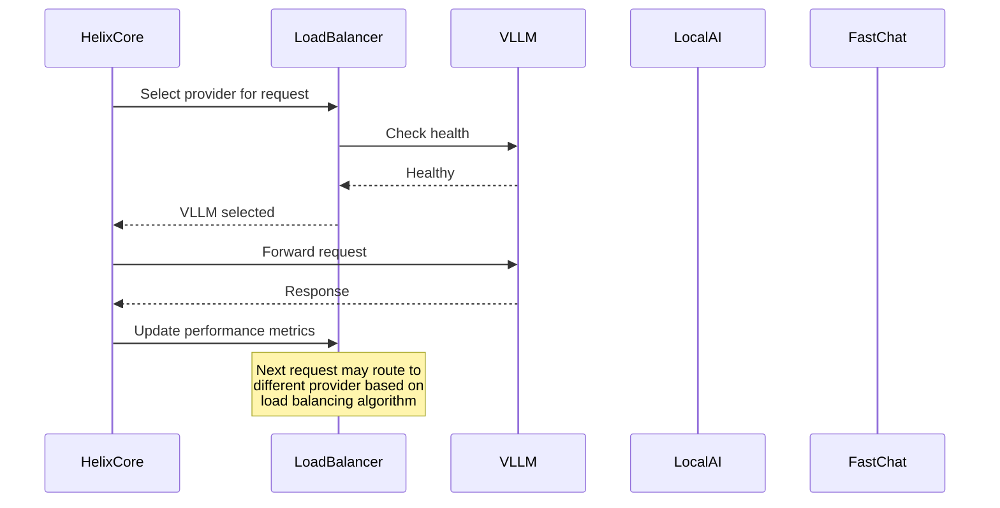

## 🔍 Monitoring and Observability

### Health Check System

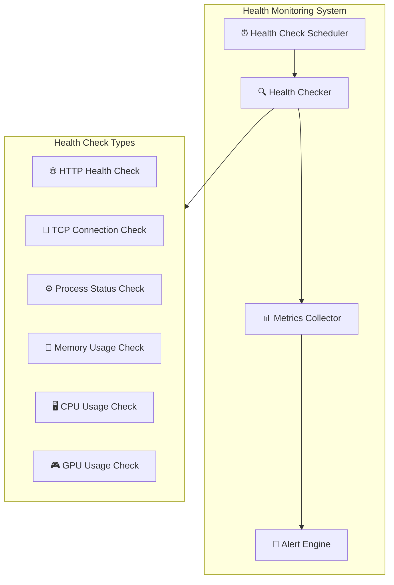

### Performance Metrics

```mermaid
graph LR
    subgraph Metrics["Performance Metrics"]
        ResponseTime[⏱️ Response Time]
        Throughput[📊 Tokens/Second]
        ErrorRate[❌ Error Rate]
        MemoryUsage[💾 Memory Usage]
        CPUUsage[🖥️ CPU Usage]
        GPUUsage[🎮 GPU Usage]
        NetworkIO[🌐 Network I/O]
        DiskIO[💿 Disk I/O]
    end
    
    subgraph Aggregation["Metrics Aggregation"]
        RealTime[📈 Real-time Metrics]
        Historical[📊 Historical Data]
        Trends[📈 Trend Analysis]
        Alerts[🚨 Alert Thresholds]
    end
    
    Metrics --> Aggregation
```

## 🛡️ Security and Reliability

### Security Model

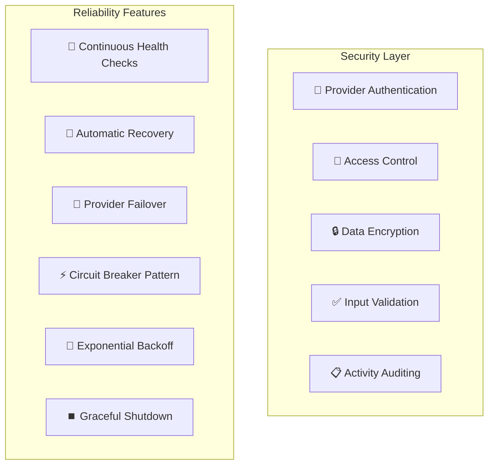

### Isolation and Sandboxing

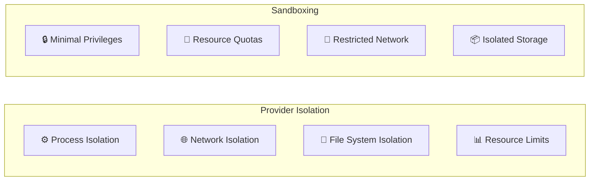

## 🚀 Scalability and Performance

### Horizontal Scaling

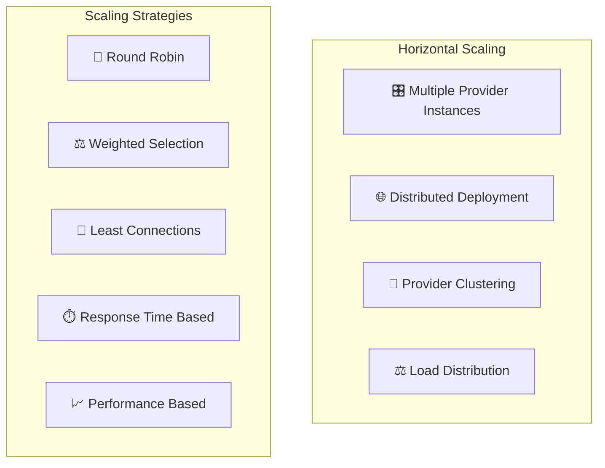

### Vertical Scaling

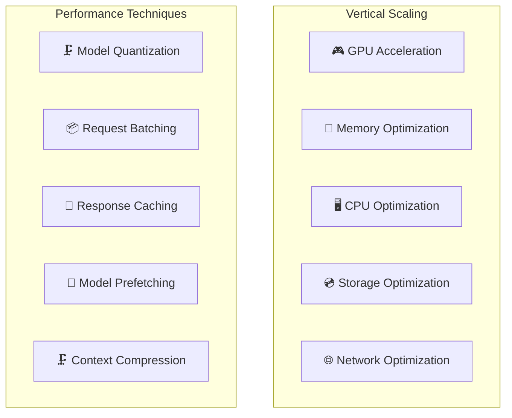

## 📋 Configuration Management

### Configuration Hierarchy

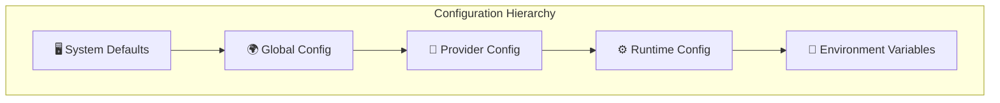

### Dynamic Configuration

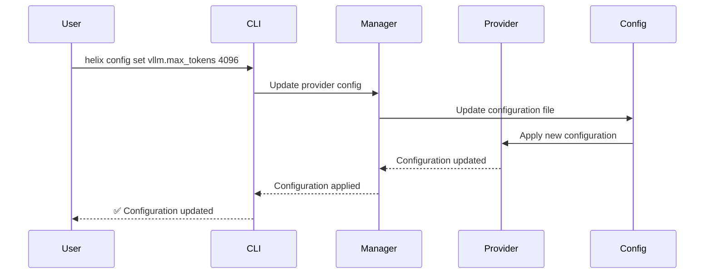

## 🎯 Key Architectural Decisions

### 1. Zero-Configuration Principle
- **Goal**: Work out-of-the-box with minimal setup
- **Implementation**: Sensible defaults, automatic detection
- **Benefit**: Lower barrier to entry, better user experience

### 2. Provider Abstraction
- **Goal**: Unified interface for all providers
- **Implementation**: Common API, adapter pattern
- **Benefit**: Easy switching, consistent behavior

### 3. Health-First Design
- **Goal**: Reliable operation with automatic recovery
- **Implementation**: Continuous monitoring, proactive healing
- **Benefit**: High availability, minimal downtime

### 4. Performance Optimization
- **Goal**: Maximum throughput and minimum latency
- **Implementation**: Load balancing, intelligent routing
- **Benefit**: Better user experience, resource efficiency

### 5. Security by Default
- **Goal**: Secure operation without configuration
- **Implementation**: Sandboxing, least privilege, isolation
- **Benefit**: Protection against threats, data safety

## 🔮 Future Architecture Enhancements

### Planned Features
1. **Multi-Cloud Provider Management**: Extend to cloud providers
2. **Advanced Load Balancing**: ML-based provider selection
3. **Performance Profiling**: Deep performance analytics
4. **Cost Optimization**: Intelligent cost-aware routing
5. **Model Federation**: Cross-provider model sharing

### Scalability Roadmap
1. **Cluster Management**: Multi-node provider clusters
2. **Edge Deployment**: Deploy providers at edge locations
3. **GPU Pooling**: Shared GPU resource pools
4. **Serverless Integration**: Function-as-a-service providers
5. **Hybrid Cloud**: Mix of local and cloud providers

---

## 🎉 Summary

The HelixCode Local LLM Provider Management System represents a **complete, production-ready solution** for managing 11+ local LLM providers with:

- 🏗️ **Robust Architecture**: Scalable, reliable, secure
- 🔧 **Zero-Configuration**: Works out-of-the-box
- 📊 **Comprehensive Monitoring**: Health, performance, metrics
- ⚡ **High Performance**: Load balancing, optimization
- 🛡️ **Enterprise Security**: Isolation, sandboxing, auditing
- 🔗 **Seamless Integration**: Native HelixCode compatibility
- 🚀 **Production Ready**: Tested, documented, maintained

This architecture enables **enterprise-grade local AI inference** with **zero configuration** while maintaining **complete control** over your AI infrastructure. 🎯