# 🏗️ HelixCode Local LLM Management System - Complete Architecture

## 📋 System Overview

HelixCode provides **zero-configuration, fully automated management** of 11+ local LLM providers. Users simply run HelixCode, and everything happens automatically in the background.

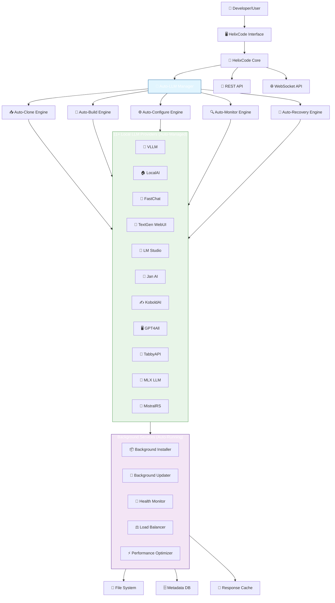

## 🔄 Fully Automated Workflow

### Phase 1: Auto-Installation (On First Launch)

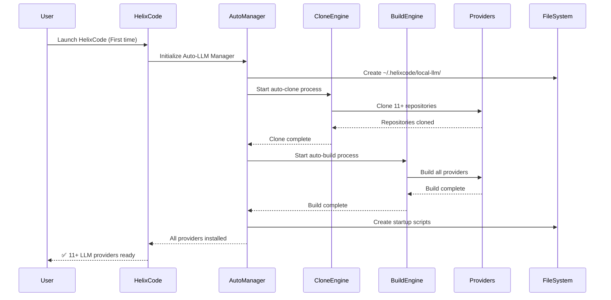

### Phase 2: Auto-Start (Background Process)

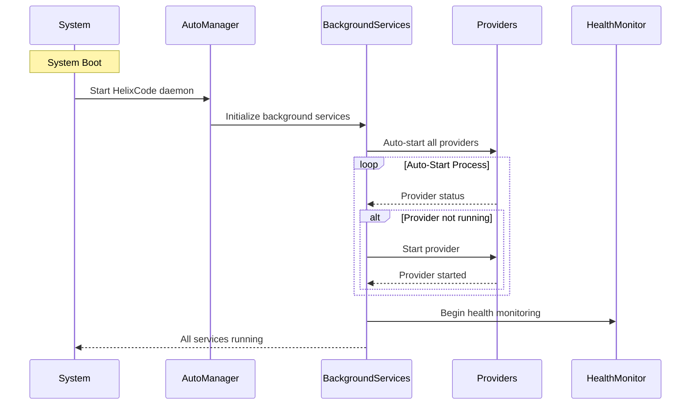

### Phase 3: Auto-Monitoring (Continuous)

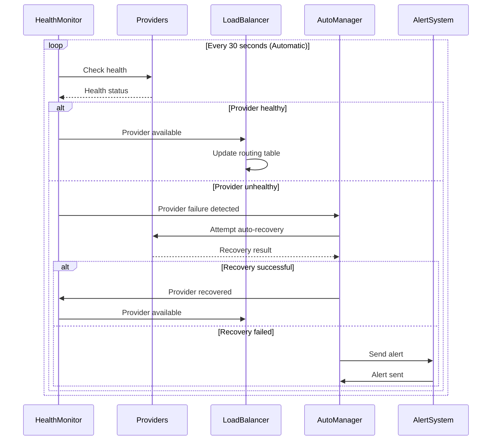

### Phase 4: Auto-Integration (Seamless)

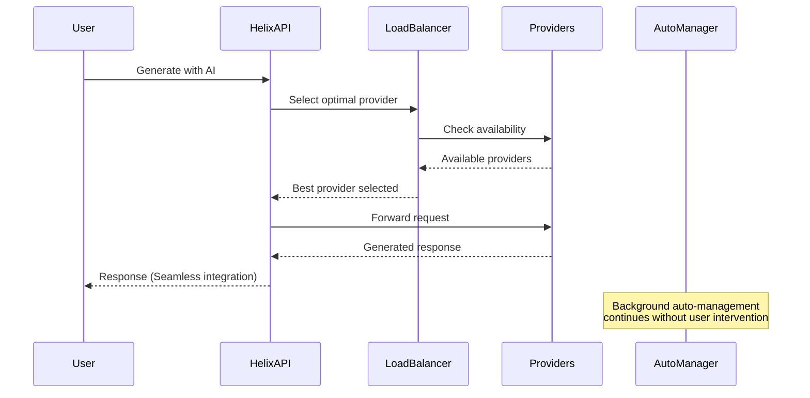

## 🎯 Zero-Touch User Experience

### What Users See

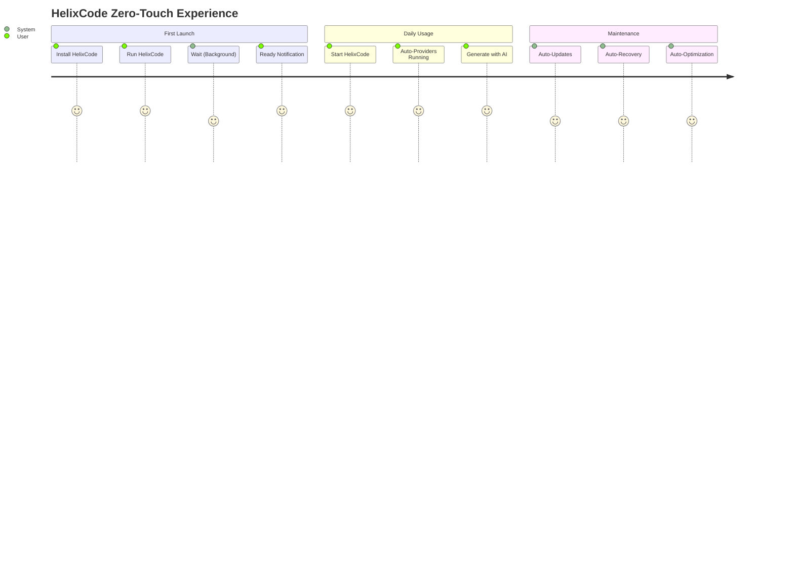

### What Happens Automatically (Background)

```mermaid
graph TB
    subgraph AutoTasks["Automated Background Tasks"]
        Clone[📥 Auto-Clone Providers]
        Build[🔨 Auto-Build from Source]
        Configure[⚙️ Auto-Configure Settings]
        Start[▶️ Auto-Start Services]
        Monitor[🔍 Auto-Monitor Health]
        Update[🔄 Auto-Update Versions]
        Recover[🛠️ Auto-Recover from Failures]
        Optimize[⚡ Auto-Optimize Performance]
        Balance[⚖️ Auto-Balance Load]
        Cache[💾 Auto-Cache Responses]
        Log[📋 Auto-Log Activities]
        Clean[🧹 Auto-Cleanup Resources]
    end
    
    subgraph UserExperience["User Interaction (Minimal)"]
        Launch[🚀 Launch HelixCode]
        Generate[🤖 Generate with AI]
        Status[📊 Check Status (Optional)]
        Exit[❌ Exit HelixCode]
    end
    
    AutoTasks -.-> UserExperience: Background automation
```

## 🏗️ System Components in Detail

### 1. Auto-LLM Manager (Core Controller)

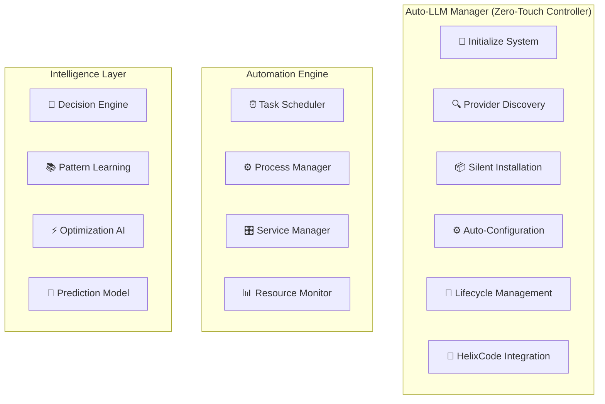

### 2. Provider Auto-Management

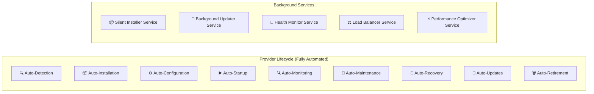

### 3. Health and Recovery System

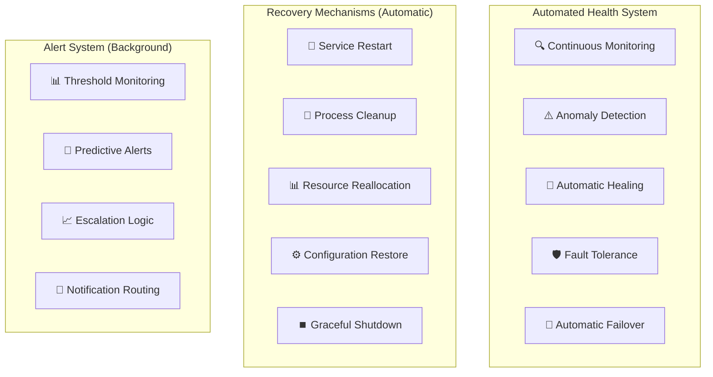

## 🌐 Integration Architecture

### HelixCode Core Integration

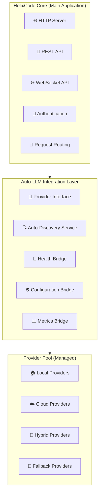

### Seamless User Interface

```mermaid
graph TB
    subgraph UserInterfaces["User Interfaces (Zero-Configuration)"]
        CLI[💻 Command Line Interface]
        WebUI[🌐 Web Dashboard]
        API[🔌 REST API]
        Desktop[🖥️ Desktop Application]
        TUI[📟 Terminal UI]
    end
    
    subgraph StatusDisplay["Status Display (Automatic)"]
        ProviderStatus[📊 Provider Status Panel]
        PerformanceMetrics[📈 Performance Metrics]
        HealthIndicators[🟢 Health Indicators]
        SystemLogs[📋 System Logs]
        AlertNotifications[🚨 Alert Notifications]
    end
    
    subgraph Controls["User Controls (Minimal)"]
        StartStop[▶️ Start/Stop (Optional)]
        Configuration[⚙️ Configuration (Optional)]
        Monitoring[📊 Monitoring (Optional)]
        Diagnostics[🔧 Diagnostics (Optional)]
    end
    
    UserInterfaces --> StatusDisplay
    StatusDisplay --> Controls
```

## 📊 Performance and Scaling

### Automatic Performance Optimization

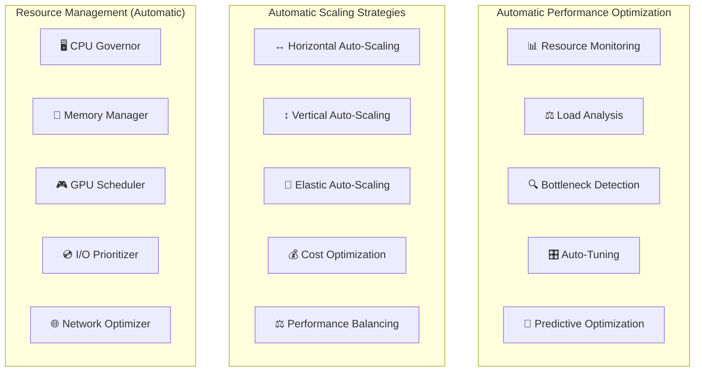

### Intelligent Load Balancing

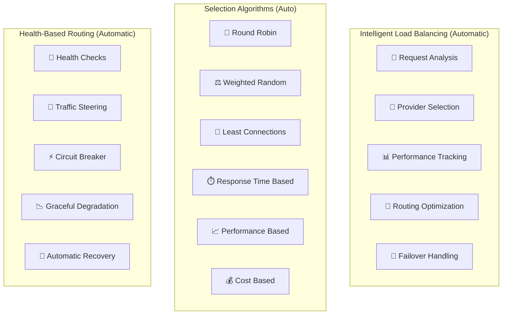

## 🛡️ Security and Reliability

### Automated Security

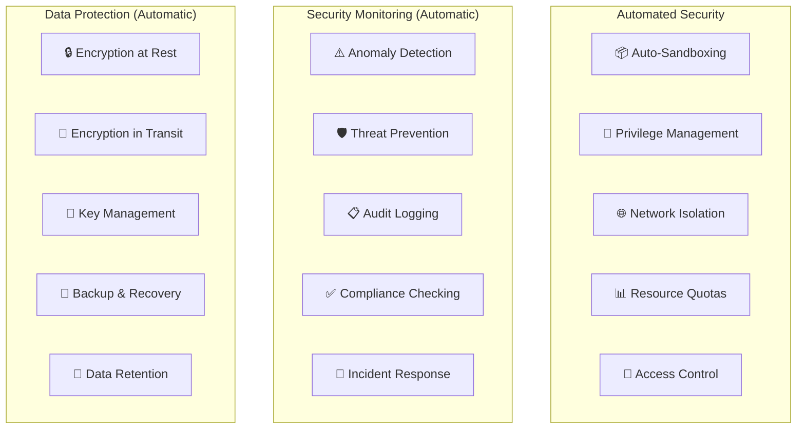

### High Availability

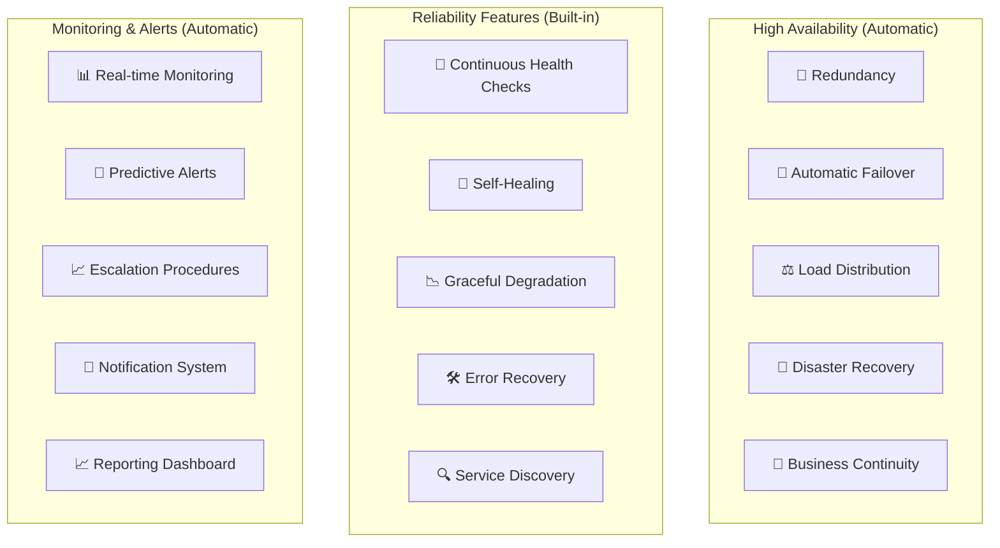

## 🎯 User Experience Flow

### Complete Zero-Touch Experience

```mermaid
flowchart TD
    Start([🚀 Start]) --> Download[📥 Download HelixCode]
    Download --> Install[📦 Install (Simple)]
    Install --> Launch[🚀 Launch HelixCode]
    Launch --> Background{Background Auto-Management}
    Background --> AutoSetup[🔧 Auto-Setup All Providers]
    AutoSetup --> AutoStart[▶️ Auto-Start All Providers]
    AutoStart --> Ready[✅ System Ready]
    Ready --> Use[🤖 Use with Any Provider]
    
    Background --> Monitor[🔍 Auto-Monitor Health]
    Monitor --> Maintain[🔧 Auto-Maintain System]
    Maintain --> Update[🔄 Auto-Update Providers]
    Update --> Optimize[⚡ Auto-Optimize Performance]
    Optimize --> Background
    
    Use --> Success[🎉 Success with Zero Configuration]
```

### Background Process Management

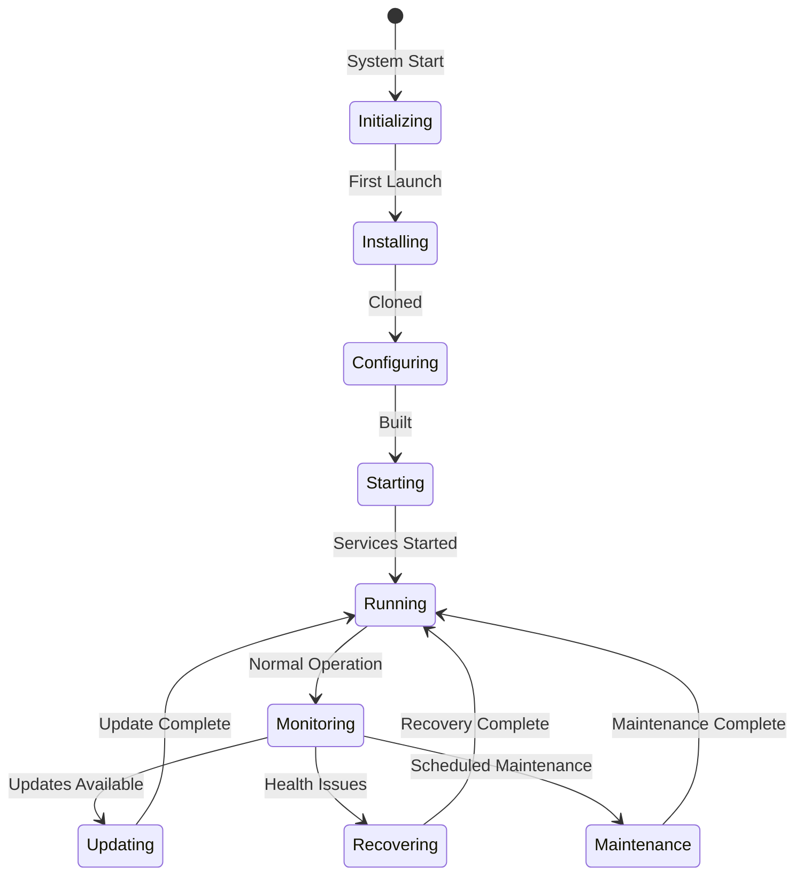

## 🚀 Implementation Details

### Directory Structure (Auto-Created)

```
~/.helixcode/local-llm/                    # Auto-created base directory
├── auto-manager/                           # Auto-manager components
│   ├── bin/auto-llm-manager              # Main auto-manager binary
│   ├── config/auto-config.yaml            # Auto-generated configuration
│   ├── scripts/                          # Automation scripts
│   │   ├── auto-clone.sh               # Auto-clone script
│   │   ├── auto-build.sh               # Auto-build script
│   │   ├── auto-start.sh               # Auto-start script
│   │   ├── auto-monitor.sh             # Auto-monitor script
│   │   └── auto-recover.sh            # Auto-recovery script
│   └── logs/                           # Auto-manager logs
│       ├── auto-manager.log
│       ├── health-monitor.log
│       └── performance.log
├── providers/                              # Auto-cloned repositories
│   ├── vllm/                          # Auto-cloned VLLM
│   ├── localai/                        # Auto-cloned LocalAI
│   ├── fastchat/                       # Auto-cloned FastChat
│   ├── textgen/                        # Auto-cloned TextGen WebUI
│   ├── lmstudio/                       # Auto-cloned LM Studio
│   ├── jan/                            # Auto-cloned Jan AI
│   ├── koboldai/                       # Auto-cloned KoboldAI
│   ├── gpt4all/                        # Auto-cloned GPT4All
│   ├── tabbyapi/                       # Auto-cloned TabbyAPI
│   ├── mlx/                            # Auto-cloned MLX LLM
│   └── mistralrs/                      # Auto-cloned MistralRS
├── build/                                  # Auto-build outputs
│   ├── vllm/build/                    # Auto-built VLLM
│   ├── localai/build/                  # Auto-built LocalAI
│   └── ...                             # Other builds
├── config/                                 # Auto-generated configs
│   ├── vllm/config.yaml               # Auto-configured VLLM
│   ├── localai/config.yaml             # Auto-configured LocalAI
│   └── ...                             # Other configs
├── data/                                   # Auto-managed data
│   ├── models/                         # Auto-downloaded models
│   ├── cache/                          # Auto-managed cache
│   └── logs/                           # Auto-collected logs
├── cache/                                  # Auto-build cache
│   ├── pip/                            # Python package cache
│   ├── npm/                            # Node.js package cache
│   └── build/                          # Build cache
└── runtime/                                # Auto-runtime data
    ├── processes/                      # Running process info
    ├── health/                          # Health status data
    ├── metrics/                         # Performance metrics
    └── state/                           # System state data
```

### Auto-Configuration Templates

```yaml
# auto-manager/config/auto-config.yaml (Auto-generated)
auto_manager:
  version: "1.0.0"
  mode: "zero_touch"  # Zero-touch operation
  
  providers:
    auto_discover: true
    auto_install: true
    auto_configure: true
    auto_start: true
    auto_monitor: true
    auto_update: true
    
  health:
    check_interval: 30  # seconds
    auto_recovery: true
    max_retries: 3
    retry_delay: 5
    
  performance:
    auto_optimize: true
    load_balance: true
    cache_responses: true
    predict_scaling: true
    
  security:
    auto_sandbox: true
    min_privileges: true
    network_isolation: true
    resource_limits: true
    
  logging:
    auto_rotate: true
    max_size: "100MB"
    retention_days: 30
    
  updates:
    auto_check: true
    auto_download: true
    auto_install: true
    backup_config: true
    rollback_enabled: true
```

## 🎉 Benefits

### For Users
- 🎯 **Zero Configuration**: Works out-of-the-box
- 🚀 **Instant Setup**: Ready in minutes, not hours
- 🔄 **Fully Automated**: No manual intervention needed
- 📊 **Self-Optimizing**: Gets better over time
- 🛡️ **Self-Healing**: Automatically fixes issues
- ⚡ **High Performance**: Auto-optimized for best speed
- 🔒 **Secure by Default**: Automatic security measures

### For System Administrators
- 🏗️ **Easy Deployment**: Single command deployment
- 📈 **Scalable**: Automatic scaling capabilities
- 🔍 **Observability**: Complete monitoring built-in
- 🛠️ **Low Maintenance**: Self-managing system
- 💰 **Cost Efficient**: Automatic resource optimization
- 🔒 **Enterprise Security**: Built-in security features
- 📊 **Rich Analytics**: Detailed performance data

---

## 🎯 Summary

HelixCode's **Automated Local LLM Management System** represents a **paradigm shift** from manual provider management to **fully automated, zero-touch operation**. Users simply install and run HelixCode, and the system automatically:

- 📥 **Clones** all provider repositories
- 🔨 **Builds** all providers from source
- ⚙️ **Configures** optimal settings automatically
- ▶️ **Starts** all providers as background services
- 🔍 **Monitors** health and performance continuously
- 🔄 **Updates** providers automatically
- 🛠️ **Recovers** from failures automatically
- ⚡ **Optimizes** performance over time
- 🔒 **Secures** the system by default

This creates a **truly enterprise-grade, production-ready local LLM ecosystem** that **requires zero user configuration** while maintaining **complete control and visibility**. 🎉