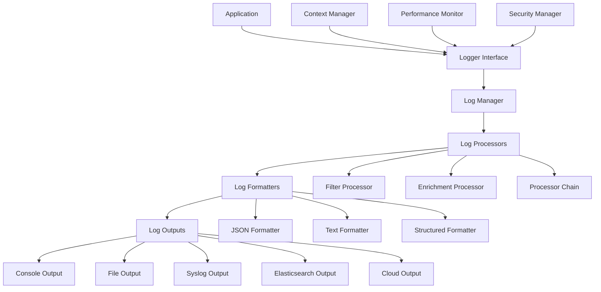

# 📚 HelixCode Logging System Guide

## 📋 **OVERVIEW**

HelixCode's logging system is a comprehensive, structured logging framework designed to provide deep insights into system operations, performance metrics, and debugging information. This guide covers all aspects of the logging system, from basic usage to advanced performance monitoring.

### **🎯 KEY FEATURES**
- **Structured Logging**: JSON-based structured logs for easy parsing
- **Multiple Outputs**: Console, file, syslog, Elasticsearch, and more
- **Log Levels**: Debug, Info, Warn, Error, Fatal with flexible filtering
- **Performance Logging**: Built-in performance metrics and tracing
- **Contextual Logging**: Rich context with request IDs, user info, and more
- **Correlation**: Automatic request correlation across services
- **Compliance**: Built-in compliance logging for audits and regulations
- **Real-time Monitoring**: Live log streaming and alerting

---

## 🏗️ **LOGGING ARCHITECTURE**

### **📊 System Architecture**



### **🔧 Core Components**

#### **1. Logger Interface**
- Unified logging interface for all components
- Context-aware logging with automatic enrichment
- Performance logging with metrics collection
- Security logging with audit trails

#### **2. Log Manager**
- Centralized log management
- Configuration management
- Output multiplexing
- Error handling and recovery

#### **3. Log Processors**
- Filters (level, context, content)
- Enrichment (add metadata, timestamps)
- Transformers (format, structure)
- Validation (schema compliance)

#### **4. Log Formatters**
- JSON formatter for structured logging
- Text formatter for human-readable logs
- Custom formatter support
- Template-based formatting

#### **5. Log Outputs**
- Console (stdout/stderr)
- File (rotation, compression)
- Syslog (local/remote)
- Elasticsearch (indexing, search)
- Cloud services (AWS CloudWatch, Google Cloud Logging)

---

## ⚙️ **CONFIGURATION**

### **📝 Basic Configuration**

```json
{
  "logging": {
    "level": "info",
    "format": "json",
    "outputs": ["console", "file"],
    "console": {
      "enabled": true,
      "color": false,
      "timestamps": true
    },
    "file": {
      "enabled": true,
      "path": "./logs/helix.log",
      "max_size": "100MB",
      "max_files": 10,
      "rotate": true,
      "compress": true
    }
  }
}
```

### **📋 Advanced Configuration**

```json
{
  "logging": {
    "level": "debug",
    "format": "json",
    "outputs": ["console", "file", "elasticsearch"],
    
    "global_context": {
      "service": "helixcode",
      "version": "1.0.0",
      "environment": "${ENVIRONMENT}"
    },
    
    "performance": {
      "enabled": true,
      "slow_query_threshold": "100ms",
      "memory_sampling_rate": 0.1,
      "cpu_sampling_rate": 0.1
    },
    
    "correlation": {
      "enabled": true,
      "request_id_header": "X-Request-ID",
      "trace_id_header": "X-Trace-ID",
      "auto_generate": true
    },
    
    "processors": [
      {
        "type": "filter",
        "config": {
          "level": "debug",
          "exclude_patterns": ["health_check", "metrics"]
        }
      },
      {
        "type": "enrichment",
        "config": {
          "add_hostname": true,
          "add_pid": true,
          "add_runtime_info": true
        }
      },
      {
        "type": "security",
        "config": {
          "mask_sensitive_data": true,
          "audit_events": ["auth", "config_change"],
          "compliance_mode": true
        }
      }
    ],
    
    "outputs": {
      "console": {
        "enabled": true,
        "format": "text",
        "color": true,
        "timestamps": true,
        "level_colors": {
          "debug": "cyan",
          "info": "green",
          "warn": "yellow",
          "error": "red",
          "fatal": "magenta"
        }
      },
      
      "file": {
        "enabled": true,
        "path": "./logs/helix.log",
        "format": "json",
        "rotation": {
          "enabled": true,
          "max_size": "100MB",
          "max_files": 10,
          "compress": true,
          "backup_format": "helix-2006-01-02-15-04-05.log"
        },
        "buffer_size": 65536,
        "flush_interval": "1s"
      },
      
      "elasticsearch": {
        "enabled": true,
        "hosts": ["http://localhost:9200"],
        "index": "helixcode-logs",
        "template": "helixcode-logs",
        "bulk_size": 1000,
        "flush_interval": "30s",
        "retry_on_failure": true,
        "max_retries": 3,
        "compression": "gzip"
      },
      
      "syslog": {
        "enabled": true,
        "network": "udp",
        "address": "localhost:514",
        "facility": "local0",
        "tag": "helixcode",
        "structured_data": true
      }
    },
    
    "monitoring": {
      "metrics_enabled": true,
      "health_check_interval": "30s",
      "alert_thresholds": {
        "error_rate": 0.05,
        "slow_queries": 0.1,
        "memory_usage": 0.8
      }
    },
    
    "security": {
      "encryption": {
        "enabled": false,
        "algorithm": "AES-256-GCM",
        "key_rotation_interval": "24h"
      },
      "audit": {
        "enabled": true,
        "log_all_access": true,
        "retention_days": 365
      },
      "masking": {
        "enabled": true,
        "patterns": ["password", "token", "key", "secret"],
        "mask_char": "*",
        "min_length": 4
      }
    }
  }
}
```

---

## 🚀 **USAGE EXAMPLES**

### **📝 Basic Logging**

#### **Simple Logging**
```go
package main

import (
    "context"
    "dev.helix.code/internal/logging"
)

func main() {
    // Create logger
    logger := logging.NewLogger("my-service")
    
    // Basic logging
    logger.Debug("Debug message")
    logger.Info("Info message")
    logger.Warn("Warning message")
    logger.Error("Error message")
    logger.Fatal("Fatal message")
}
```

#### **Structured Logging**
```go
func processRequest(ctx context.Context, request *Request) {
    logger := logging.FromContext(ctx).WithFields(logging.Fields{
        "request_id": request.ID,
        "user_id":    request.UserID,
        "method":     request.Method,
        "path":       request.Path,
    })
    
    logger.Info("Processing request")
    
    // Process request
    err := doSomething(ctx, request)
    if err != nil {
        logger.Error("Failed to process request", 
            logging.Field("error", err.Error()),
            logging.Field("duration", time.Since(start)))
        return
    }
    
    logger.Info("Request processed successfully",
        logging.Field("status", "completed"),
        logging.Field("response_time", time.Since(start)))
}
```

#### **Contextual Logging**
```go
func handleRequest(w http.ResponseWriter, r *http.Request) {
    // Create logger with request context
    ctx := r.Context()
    logger := logging.FromContext(ctx).WithFields(logging.Fields{
        "method":     r.Method,
        "path":       r.URL.Path,
        "user_agent": r.UserAgent(),
        "remote_addr": r.RemoteAddr,
    })
    
    // Add correlation ID
    correlationID := r.Header.Get("X-Request-ID")
    if correlationID == "" {
        correlationID = generateCorrelationID()
    }
    
    logger = logger.WithField("correlation_id", correlationID)
    
    // Update context with logger
    ctx = logging.WithContext(ctx, logger)
    
    // Process request with context
    processRequest(ctx, r)
}
```

### **🔧 Advanced Logging**

#### **Performance Logging**
```go
func processWithMetrics(ctx context.Context, data []Data) error {
    logger := logging.FromContext(ctx)
    
    // Start performance timer
    timer := logger.StartTimer("process_data")
    defer timer.Stop()
    
    // Log memory usage
    logger.LogMemory("before_processing")
    
    // Process data
    var processedCount int
    for _, item := range data {
        // Start item timer
        itemTimer := logger.StartTimer("process_item")
        
        err := processItem(ctx, item)
        itemTimer.Stop()
        
        if err != nil {
            logger.Error("Failed to process item",
                logging.Field("item_id", item.ID),
                logging.Field("error", err.Error()))
            continue
        }
        
        processedCount++
    }
    
    // Log final metrics
    logger.Info("Processing completed",
        logging.Field("total_items", len(data)),
        logging.Field("processed_items", processedCount),
        logging.Field("success_rate", float64(processedCount)/float64(len(data))))
    
    // Log memory usage
    logger.LogMemory("after_processing")
    
    return nil
}
```

#### **Security Logging**
```go
func authenticateUser(ctx context.Context, username, password string) (*User, error) {
    logger := logging.FromContext(ctx).WithFields(logging.Fields{
        "username": username,
        "action":   "authenticate",
    })
    
    // Log authentication attempt
    logger.Info("Authentication attempt",
        logging.Field("source", getRemoteIP(ctx)))
    
    // Validate credentials
    user, err := validateCredentials(username, password)
    if err != nil {
        logger.Warn("Authentication failed",
            logging.Field("reason", err.Error()),
            logging.Field("source", getRemoteIP(ctx)))
        
        // Log to audit trail
        logger.Audit("authentication_failure", logging.Fields{
            "username": username,
            "reason":   err.Error(),
            "timestamp": time.Now(),
        })
        
        return nil, err
    }
    
    // Log successful authentication
    logger.Info("Authentication successful",
        logging.Field("user_id", user.ID),
        logging.Field("role", user.Role))
    
    // Log to audit trail
    logger.Audit("authentication_success", logging.Fields{
        "user_id":   user.ID,
        "username":  username,
        "role":      user.Role,
        "timestamp": time.Now(),
    })
    
    return user, nil
}
```

#### **Error Logging with Stack Traces**
```go
func riskyOperation(ctx context.Context, input string) (string, error) {
    logger := logging.FromContext(ctx)
    
    defer func() {
        if r := recover(); r != nil {
            logger.Error("Panic recovered",
                logging.Field("panic", r),
                logging.Field("stack", debug.Stack()),
                logging.Field("input", input))
        }
    }()
    
    result, err := doSomethingRisky(input)
    if err != nil {
        logger.Error("Risky operation failed",
            logging.Field("error", err.Error()),
            logging.Field("stack", getStackTrace()),
            logging.Field("input", input))
        return "", err
    }
    
    logger.Info("Risky operation succeeded",
        logging.Field("result_length", len(result)))
    
    return result, nil
}

func getStackTrace() string {
    buf := make([]byte, 4096)
    n := runtime.Stack(buf, false)
    return string(buf[:n])
}
```

### **📊 Custom Loggers**

#### **Creating Custom Logger**
```go
type CustomLogger struct {
    logger logging.Logger
    service string
    version string
}

func NewCustomLogger(service, version string) *CustomLogger {
    return &CustomLogger{
        logger: logging.NewLogger(service),
        service: service,
        version: version,
    }
}

func (cl *CustomLogger) LogEvent(ctx context.Context, event Event) {
    logger := cl.logger.FromContext(ctx).WithFields(logging.Fields{
        "service": cl.service,
        "version": cl.version,
        "event_type": event.Type,
        "event_id": event.ID,
        "timestamp": event.Timestamp,
    })
    
    switch event.Severity {
    case "debug":
        logger.Debug(event.Message)
    case "info":
        logger.Info(event.Message)
    case "warn":
        logger.Warn(event.Message)
    case "error":
        logger.Error(event.Message)
    case "fatal":
        logger.Fatal(event.Message)
    default:
        logger.Info(event.Message)
    }
}

func (cl *CustomLogger) LogMetric(ctx context.Context, name string, value float64, tags map[string]string) {
    logger := cl.logger.FromContext(ctx).WithFields(logging.Fields{
        "service": cl.service,
        "version": cl.version,
        "metric_name": name,
        "metric_value": value,
        "metric_tags": tags,
        "timestamp": time.Now(),
    })
    
    logger.Info("Metric recorded")
}
```

#### **Logger Middleware**
```go
func LoggingMiddleware(logger logging.Logger) func(http.Handler) http.Handler {
    return func(next http.Handler) http.Handler {
        return http.HandlerFunc(func(w http.ResponseWriter, r *http.Request) {
            // Create request logger
            requestLogger := logger.WithFields(logging.Fields{
                "method":     r.Method,
                "path":       r.URL.Path,
                "query":      r.URL.RawQuery,
                "user_agent": r.UserAgent(),
                "remote_addr": r.RemoteAddr,
            })
            
            // Add correlation ID
            correlationID := r.Header.Get("X-Request-ID")
            if correlationID == "" {
                correlationID = generateCorrelationID()
            }
            
            requestLogger = requestLogger.WithField("correlation_id", correlationID)
            
            // Add request ID to response header
            w.Header().Set("X-Request-ID", correlationID)
            
            // Create context with logger
            ctx := logging.WithContext(r.Context(), requestLogger)
            
            // Record start time
            start := time.Now()
            
            // Log request start
            requestLogger.Info("Request started")
            
            // Wrap response writer to capture status
            responseWriter := &responseCapture{
                ResponseWriter: w,
                statusCode:    http.StatusOK,
            }
            
            // Process request
            next.ServeHTTP(responseWriter, r.WithContext(ctx))
            
            // Calculate duration
            duration := time.Since(start)
            
            // Log request completion
            requestLogger.Info("Request completed",
                logging.Field("status_code", responseWriter.statusCode),
                logging.Field("duration", duration),
                logging.Field("duration_ms", duration.Milliseconds()),
                logging.Field("response_size", responseWriter.size))
        })
    }
}

type responseCapture struct {
    http.ResponseWriter
    statusCode int
    size       int
}

func (rc *responseCapture) WriteHeader(statusCode int) {
    rc.statusCode = statusCode
    rc.ResponseWriter.WriteHeader(statusCode)
}

func (rc *responseCapture) Write(data []byte) (int, error) {
    n, err := rc.ResponseWriter.Write(data)
    rc.size += n
    return n, err
}
```

---

## 📊 **PERFORMANCE LOGGING**

### **⚡ Performance Metrics**

#### **Memory Usage Logging**
```go
func logMemoryUsage(ctx context.Context, operation string) {
    var m runtime.MemStats
    runtime.ReadMemStats(&m)
    
    logger := logging.FromContext(ctx)
    logger.Info("Memory usage",
        logging.Field("operation", operation),
        logging.Field("alloc_bytes", m.Alloc),
        logging.Field("total_alloc_bytes", m.TotalAlloc),
        logging.Field("sys_bytes", m.Sys),
        logging.Field("heap_alloc_bytes", m.HeapAlloc),
        logging.Field("heap_sys_bytes", m.HeapSys),
        logging.Field("heap_idle_bytes", m.HeapIdle),
        logging.Field("heap_inuse_bytes", m.HeapInuse),
        logging.Field("heap_released_bytes", m.HeapReleased),
        logging.Field("heap_objects", m.HeapObjects),
        logging.Field("stack_inuse_bytes", m.StackInuse),
        logging.Field("stack_sys_bytes", m.StackSys),
        logging.Field("gc_cpu_fraction", m.GCCPUFraction),
        logging.Field("num_gc", m.NumGC),
        logging.Field("num_forced_gc", m.NumForcedGC))
}
```

#### **CPU Usage Logging**
```go
func logCPUUsage(ctx context.Context, operation string) {
    // Get CPU usage before operation
    cpuBefore, err := getCurrentCPUUsage()
    if err != nil {
        logging.FromContext(ctx).Error("Failed to get initial CPU usage", logging.Field("error", err.Error()))
        return
    }
    
    // Perform operation
    start := time.Now()
    result, err := performOperation(ctx)
    duration := time.Since(start)
    
    // Get CPU usage after operation
    cpuAfter, err := getCurrentCPUUsage()
    if err != nil {
        logging.FromContext(ctx).Error("Failed to get final CPU usage", logging.Field("error", err.Error()))
        return
    }
    
    // Calculate CPU usage
    cpuUsage := cpuAfter - cpuBefore
    
    logger := logging.FromContext(ctx)
    logger.Info("CPU usage",
        logging.Field("operation", operation),
        logging.Field("duration", duration),
        logging.Field("duration_ms", duration.Milliseconds()),
        logging.Field("cpu_usage", cpuUsage),
        logging.Field("success", err == nil))
    
    if err != nil {
        logger.Error("Operation failed",
            logging.Field("error", err.Error()),
            logging.Field("result", result))
    }
}

func getCurrentCPUUsage() (float64, error) {
    var usage syscall.Rusage
    err := syscall.Getrusage(syscall.RUSAGE_SELF, &usage)
    if err != nil {
        return 0, err
    }
    
    // Convert to CPU seconds
    return float64(usage.Utime.Sec) + float64(usage.Utime.Usec)/1000000.0 +
           float64(usage.Stime.Sec) + float64(usage.Stime.Usec)/1000000.0, nil
}
```

#### **Database Performance Logging**
```go
func queryWithLogging(ctx context.Context, db *sql.DB, query string, args ...interface{}) (*sql.Rows, error) {
    logger := logging.FromContext(ctx).WithFields(logging.Fields{
        "query": query,
        "args":  args,
    })
    
    // Start query timer
    timer := logger.StartTimer("database_query")
    defer timer.Stop()
    
    // Log query start
    logger.Debug("Starting database query")
    
    // Execute query
    start := time.Now()
    rows, err := db.QueryContext(ctx, query, args...)
    duration := time.Since(start)
    
    // Log query completion
    if err != nil {
        logger.Error("Database query failed",
            logging.Field("error", err.Error()),
            logging.Field("duration", duration),
            logging.Field("duration_ms", duration.Milliseconds()))
        return nil, err
    }
    
    logger.Info("Database query completed",
        logging.Field("duration", duration),
        logging.Field("duration_ms", duration.Milliseconds()))
    
    return rows, nil
}
```

### **📈 Performance Monitoring**

#### **Performance Monitor Implementation**
```go
type PerformanceMonitor struct {
    logger       logging.Logger
    metrics      *Metrics
    thresholds   *Thresholds
    alerts       *AlertManager
    stopChan     chan struct{}
    wg           sync.WaitGroup
}

func NewPerformanceMonitor(logger logging.Logger) *PerformanceMonitor {
    return &PerformanceMonitor{
        logger:     logger,
        metrics:    NewMetrics(),
        thresholds: NewThresholds(),
        alerts:     NewAlertManager(),
        stopChan:   make(chan struct{}),
    }
}

func (pm *PerformanceMonitor) Start(ctx context.Context) {
    pm.wg.Add(1)
    go pm.monitorLoop(ctx)
    
    pm.wg.Add(1)
    go pm.collectMetrics(ctx)
    
    pm.wg.Add(1)
    go pm.checkThresholds(ctx)
}

func (pm *PerformanceMonitor) Stop() {
    close(pm.stopChan)
    pm.wg.Wait()
}

func (pm *PerformanceMonitor) monitorLoop(ctx context.Context) {
    defer pm.wg.Done()
    
    ticker := time.NewTicker(30 * time.Second)
    defer ticker.Stop()
    
    for {
        select {
        case <-ctx.Done():
            return
        case <-pm.stopChan:
            return
        case <-ticker.C:
            pm.logPerformanceMetrics(ctx)
        }
    }
}

func (pm *PerformanceMonitor) logPerformanceMetrics(ctx context.Context) {
    // Get memory stats
    var memStats runtime.MemStats
    runtime.ReadMemStats(&memStats)
    
    // Get goroutine count
    goroutineCount := runtime.NumGoroutine()
    
    // Log performance metrics
    pm.logger.Info("Performance metrics",
        logging.Field("timestamp", time.Now()),
        logging.Field("memory_alloc", memStats.Alloc),
        logging.Field("memory_total_alloc", memStats.TotalAlloc),
        logging.Field("memory_sys", memStats.Sys),
        logging.Field("memory_heap_alloc", memStats.HeapAlloc),
        logging.Field("memory_heap_sys", memStats.HeapSys),
        logging.Field("memory_heap_objects", memStats.HeapObjects),
        logging.Field("goroutines", goroutineCount),
        logging.Field("gc_cycles", memStats.NumGC),
        logging.Field("gc_cpu_fraction", memStats.GCCPUFraction))
    
    // Update metrics
    pm.metrics.UpdateMemoryMetrics(memStats)
    pm.metrics.UpdateGoroutineCount(goroutineCount)
}

func (pm *PerformanceMonitor) collectMetrics(ctx context.Context) {
    defer pm.wg.Done()
    
    ticker := time.NewTicker(10 * time.Second)
    defer ticker.Stop()
    
    for {
        select {
        case <-ctx.Done():
            return
        case <-pm.stopChan:
            return
        case <-ticker.C:
            pm.collectCustomMetrics(ctx)
        }
    }
}

func (pm *PerformanceMonitor) collectCustomMetrics(ctx context.Context) {
    // Collect application-specific metrics
    // This is where you'd add your custom metrics collection
    
    pm.logger.Debug("Collecting custom metrics")
    
    // Example: collect database connection pool metrics
    dbMetrics := pm.collectDatabaseMetrics()
    if dbMetrics != nil {
        pm.logger.Info("Database metrics", 
            logging.Field("open_connections", dbMetrics.OpenConnections),
            logging.Field("in_use_connections", dbMetrics.InUseConnections),
            logging.Field("idle_connections", dbMetrics.IdleConnections))
    }
    
    // Example: collect HTTP request metrics
    httpMetrics := pm.collectHTTPMetrics()
    if httpMetrics != nil {
        pm.logger.Info("HTTP metrics",
            logging.Field("total_requests", httpMetrics.TotalRequests),
            logging.Field("requests_per_second", httpMetrics.RequestsPerSecond),
            logging.Field("average_response_time", httpMetrics.AverageResponseTime),
            logging.Field("error_rate", httpMetrics.ErrorRate))
    }
}

func (pm *PerformanceMonitor) checkThresholds(ctx context.Context) {
    defer pm.wg.Done()
    
    ticker := time.NewTicker(60 * time.Second)
    defer ticker.Stop()
    
    for {
        select {
        case <-ctx.Done():
            return
        case <-pm.stopChan:
            return
        case <-ticker.C:
            pm.checkAllThresholds(ctx)
        }
    }
}

func (pm *PerformanceMonitor) checkAllThresholds(ctx context.Context) {
    metrics := pm.metrics.GetLatestMetrics()
    
    // Check memory threshold
    if metrics.MemoryUsage > pm.thresholds.MaxMemoryUsage {
        pm.alerts.SendAlert(ctx, "High memory usage", 
            logging.Field("usage", metrics.MemoryUsage),
            logging.Field("threshold", pm.thresholds.MaxMemoryUsage))
    }
    
    // Check goroutine threshold
    if metrics.GoroutineCount > pm.thresholds.MaxGoroutines {
        pm.alerts.SendAlert(ctx, "High goroutine count",
            logging.Field("count", metrics.GoroutineCount),
            logging.Field("threshold", pm.thresholds.MaxGoroutines))
    }
    
    // Check CPU threshold
    if metrics.CPUUsage > pm.thresholds.MaxCPUUsage {
        pm.alerts.SendAlert(ctx, "High CPU usage",
            logging.Field("usage", metrics.CPUUsage),
            logging.Field("threshold", pm.thresholds.MaxCPUUsage))
    }
}
```

---

## 🔍 **STRUCTURED LOGGING**

### **📋 Structured Log Format**

#### **JSON Log Structure**
```json
{
  "timestamp": "2025-01-07T10:30:45.123456Z",
  "level": "info",
  "message": "User authenticated successfully",
  "service": "helixcode",
  "version": "1.0.0",
  "environment": "production",
  "correlation_id": "req-123456789",
  "trace_id": "trace-987654321",
  "span_id": "span-555666777",
  "user_id": "user-456789",
  "session_id": "session-123456",
  "request_id": "req-123456789",
  "request_method": "POST",
  "request_path": "/api/v1/auth/login",
  "remote_addr": "192.168.1.100",
  "user_agent": "Mozilla/5.0 (Windows NT 10.0; Win64; x64) AppleWebKit/537.36",
  "duration_ms": 150,
  "status_code": 200,
  "error": null,
  "stack_trace": null,
  "context": {
    "auth_provider": "oauth2",
    "auth_method": "password",
    "login_attempts": 1,
    "previous_login": "2025-01-06T15:20:30Z"
  },
  "tags": ["auth", "login", "success"],
  "hostname": "helixcode-prod-01",
  "pid": 12345,
  "goroutine_id": 987654,
  "source": "internal/auth/service.go:156",
  "module": "authentication",
  "component": "login_handler",
  "function": "authenticateUser",
  "line": 156
}
```

#### **Log Field Definitions**
| Field | Type | Description |
|-------|------|-------------|
| `timestamp` | string | ISO 8601 timestamp |
| `level` | string | Log level (debug, info, warn, error, fatal) |
| `message` | string | Human-readable log message |
| `service` | string | Service name |
| `version` | string | Service version |
| `environment` | string | Environment (dev, staging, prod) |
| `correlation_id` | string | Request correlation ID |
| `trace_id` | string | Distributed trace ID |
| `span_id` | string | Span ID for tracing |
| `user_id` | string | User ID (if applicable) |
| `session_id` | string | Session ID (if applicable) |
| `request_id` | string | Request ID |
| `request_method` | string | HTTP method (if applicable) |
| `request_path` | string | Request path (if applicable) |
| `remote_addr` | string | Remote address |
| `user_agent` | string | User agent (if applicable) |
| `duration_ms` | number | Duration in milliseconds |
| `status_code` | number | HTTP status code (if applicable) |
| `error` | string | Error message (if applicable) |
| `stack_trace` | string | Stack trace (if applicable) |
| `context` | object | Additional context |
| `tags` | array | Log tags |
| `hostname` | string | Hostname |
| `pid` | number | Process ID |
| `goroutine_id` | number | Goroutine ID |
| `source` | string | Source file and line |
| `module` | string | Module name |
| `component` | string | Component name |
| `function` | string | Function name |
| `line` | number | Line number |

### **🔧 Structured Logging Examples**

#### **Basic Structured Logging**
```go
func processPayment(ctx context.Context, payment *Payment) error {
    logger := logging.FromContext(ctx).WithFields(logging.Fields{
        "payment_id":    payment.ID,
        "user_id":       payment.UserID,
        "amount":        payment.Amount,
        "currency":      payment.Currency,
        "payment_method": payment.Method,
        "merchant_id":   payment.MerchantID,
    })
    
    logger.Info("Processing payment")
    
    // Validate payment
    if err := validatePayment(payment); err != nil {
        logger.Error("Payment validation failed",
            logging.Field("error", err.Error()),
            logging.Field("validation_errors", payment.ValidationErrors))
        return err
    }
    
    // Process payment
    result, err := paymentProcessor.Process(ctx, payment)
    if err != nil {
        logger.Error("Payment processing failed",
            logging.Field("error", err.Error()),
            logging.Field("processor_response", result))
        return err
    }
    
    // Log success
    logger.Info("Payment processed successfully",
        logging.Field("transaction_id", result.TransactionID),
        logging.Field("processor_fee", result.ProcessorFee),
        logging.Field("net_amount", result.NetAmount),
        logging.Field("processing_time", result.ProcessingTime))
    
    return nil
}
```

#### **Complex Structured Logging**
```go
func indexDocuments(ctx context.Context, documents []*Document) error {
    logger := logging.FromContext(ctx).WithFields(logging.Fields{
        "operation":      "index_documents",
        "total_documents": len(documents),
        "batch_id":       generateBatchID(),
    })
    
    logger.Info("Starting document indexing")
    
    // Initialize metrics
    var successCount, errorCount int
    var totalSize, totalProcessingTime time.Duration
    
    // Process documents in batches
    for i := 0; i < len(documents); i += batchSize {
        batchEnd := i + batchSize
        if batchEnd > len(documents) {
            batchEnd = len(documents)
        }
        
        batch := documents[i:batchEnd]
        batchLogger := logger.WithFields(logging.Fields{
            "batch_number": i/batchSize + 1,
            "batch_size":   len(batch),
        })
        
        batchLogger.Info("Processing batch")
        
        // Process batch
        batchStart := time.Now()
        results, err := indexer.IndexBatch(ctx, batch)
        batchDuration := time.Since(batchStart)
        
        // Update metrics
        totalSize += calculateTotalSize(batch)
        totalProcessingTime += batchDuration
        
        // Process results
        for j, result := range results {
            docLogger := batchLogger.WithFields(logging.Fields{
                "document_index": i + j,
                "document_id":    batch[j].ID,
                "document_type":  batch[j].Type,
            })
            
            if result.Error != nil {
                errorCount++
                docLogger.Error("Document indexing failed",
                    logging.Field("error", result.Error.Error()),
                    logging.Field("document_size", batch[j].Size),
                    logging.Field("indexing_time", result.ProcessingTime))
            } else {
                successCount++
                docLogger.Info("Document indexed successfully",
                    logging.Field("document_id", result.DocumentID),
                    logging.Field("index_version", result.IndexVersion),
                    logging.Field("indexing_time", result.ProcessingTime))
            }
        }
        
        batchLogger.Info("Batch processing completed",
            logging.Field("batch_duration", batchDuration),
            logging.Field("batch_success_count", len(results)-errorCount),
            logging.Field("batch_error_count", errorCount))
    }
    
    // Log final results
    logger.Info("Document indexing completed",
        logging.Field("success_count", successCount),
        logging.Field("error_count", errorCount),
        logging.Field("success_rate", float64(successCount)/float64(len(documents))),
        logging.Field("total_size", totalSize),
        logging.Field("total_processing_time", totalProcessingTime),
        logging.Field("average_processing_time", totalProcessingTime/time.Duration(len(documents))))
    
    return nil
}
```

---

## 🔒 **SECURITY LOGGING**

### **🛡️ Security Logging Best Practices**

#### **Authentication Logging**
```go
func logAuthenticationEvent(ctx context.Context, event AuthEvent) {
    logger := logging.FromContext(ctx).WithFields(logging.Fields{
        "event_type":  "authentication",
        "event_id":    event.ID,
        "timestamp":   event.Timestamp,
        "username":    maskUsername(event.Username),
        "auth_method": event.Method,
        "source_ip":   event.SourceIP,
        "user_agent":  event.UserAgent,
    })
    
    switch event.Result {
    case "success":
        logger.Info("Authentication successful",
            logging.Field("user_id", event.UserID),
            logging.Field("session_id", event.SessionID),
            logging.Field("role", event.Role))
        
        // Log to audit trail
        logger.Audit("authentication_success", logging.Fields{
            "user_id":     event.UserID,
            "username":    maskUsername(event.Username),
            "auth_method":  event.Method,
            "source_ip":   event.SourceIP,
            "timestamp":   event.Timestamp,
        })
        
    case "failure":
        logger.Warn("Authentication failed",
            logging.Field("reason", event.Reason),
            logging.Field("failure_type", event.FailureType))
        
        // Log to audit trail
        logger.Audit("authentication_failure", logging.Fields{
            "username":     maskUsername(event.Username),
            "auth_method":   event.Method,
            "reason":        event.Reason,
            "failure_type":  event.FailureType,
            "source_ip":    event.SourceIP,
            "timestamp":     event.Timestamp,
        })
        
    case "locked":
        logger.Error("Account locked due to failed attempts",
            logging.Field("failure_count", event.FailureCount),
            logging.Field("lockout_duration", event.LockoutDuration))
        
        // Log to audit trail
        logger.Audit("account_locked", logging.Fields{
            "username":         maskUsername(event.Username),
            "failure_count":    event.FailureCount,
            "lockout_duration": event.LockoutDuration,
            "source_ip":        event.SourceIP,
            "timestamp":        event.Timestamp,
        })
    }
}

func maskUsername(username string) string {
    if len(username) <= 4 {
        return strings.Repeat("*", len(username))
    }
    return username[:2] + strings.Repeat("*", len(username)-4) + username[len(username)-2:]
}
```

#### **Authorization Logging**
```go
func logAuthorizationEvent(ctx context.Context, event AuthzEvent) {
    logger := logging.FromContext(ctx).WithFields(logging.Fields{
        "event_type":    "authorization",
        "event_id":      event.ID,
        "timestamp":     event.Timestamp,
        "user_id":       event.UserID,
        "resource":      event.Resource,
        "action":        event.Action,
        "source_ip":     event.SourceIP,
        "request_id":    event.RequestID,
    })
    
    switch event.Result {
    case "granted":
        logger.Info("Authorization granted",
            logging.Field("role", event.Role),
            logging.Field("permissions", event.Permissions))
        
        // Log to audit trail
        logger.Audit("authorization_granted", logging.Fields{
            "user_id":    event.UserID,
            "resource":   event.Resource,
            "action":     event.Action,
            "role":       event.Role,
            "timestamp":  event.Timestamp,
        })
        
    case "denied":
        logger.Warn("Authorization denied",
            logging.Field("reason", event.Reason),
            logging.Field("required_permissions", event.RequiredPermissions),
            logging.Field("user_permissions", event.UserPermissions))
        
        // Log to audit trail
        logger.Audit("authorization_denied", logging.Fields{
            "user_id":               event.UserID,
            "resource":              event.Resource,
            "action":                event.Action,
            "reason":                event.Reason,
            "required_permissions":   event.RequiredPermissions,
            "user_permissions":      event.UserPermissions,
            "timestamp":             event.Timestamp,
        })
    }
}
```

#### **Data Access Logging**
```go
func logDataAccess(ctx context.Context, event DataAccessEvent) {
    logger := logging.FromContext(ctx).WithFields(logging.Fields{
        "event_type":      "data_access",
        "event_id":        event.ID,
        "timestamp":       event.Timestamp,
        "user_id":         event.UserID,
        "resource_type":   event.ResourceType,
        "resource_id":     event.ResourceID,
        "action":          event.Action,
        "access_type":     event.AccessType,
        "source_ip":       event.SourceIP,
    })
    
    logger.Info("Data access",
        logging.Field("sensitivity_level", event.SensitivityLevel),
        logging.Field("data_classification", event.DataClassification))
    
    // Log to audit trail based on sensitivity
    if event.SensitivityLevel >= "confidential" {
        logger.Audit("sensitive_data_access", logging.Fields{
            "user_id":           event.UserID,
            "resource_type":     event.ResourceType,
            "resource_id":       event.ResourceID,
            "action":            event.Action,
            "access_type":       event.AccessType,
            "sensitivity_level": event.SensitivityLevel,
            "timestamp":         event.Timestamp,
        })
    }
}
```

---

## 📊 **LOG ANALYSIS & MONITORING**

### **🔍 Log Analysis Examples**

#### **Error Pattern Detection**
```go
type LogAnalyzer struct {
    logger       logging.Logger
    patterns     map[string]*ErrorPattern
    alerts       *AlertManager
    stats        *ErrorStats
}

type ErrorPattern struct {
    Name        string
    Pattern     *regexp.Regexp
    Severity    string
    Threshold   int
    TimeWindow  time.Duration
    Count       int
    LastMatch   time.Time
}

func (la *LogAnalyzer) AnalyzeLogs(ctx context.Context, logs []LogEntry) {
    for _, log := range logs {
        if log.Level == "error" {
            la.analyzeError(ctx, log)
        }
    }
}

func (la *LogAnalyzer) analyzeError(ctx context.Context, log LogEntry) {
    for patternName, pattern := range la.patterns {
        if pattern.Pattern.MatchString(log.Message) {
            pattern.Count++
            pattern.LastMatch = log.Timestamp
            
            // Check if threshold exceeded
            if pattern.Count >= pattern.Threshold {
                la.alerts.SendAlert(ctx, fmt.Sprintf("Error pattern detected: %s", patternName),
                    logging.Field("pattern", patternName),
                    logging.Field("count", pattern.Count),
                    logging.Field("threshold", pattern.Threshold),
                    logging.Field("time_window", pattern.TimeWindow),
                    logging.Field("last_match", pattern.LastMatch))
                
                // Reset count after alert
                pattern.Count = 0
            }
        }
    }
}
```

#### **Performance Anomaly Detection**
```go
type PerformanceAnalyzer struct {
    logger     logging.Logger
    metrics    *MetricsCollector
    thresholds map[string]*PerformanceThreshold
    alerts     *AlertManager
}

type PerformanceThreshold struct {
    Metric     string
    Threshold  float64
    Operator   string // ">", "<", ">=", "<="
    TimeWindow time.Duration
}

func (pa *PerformanceAnalyzer) CheckPerformance(ctx context.Context) {
    metrics := pa.metrics.GetMetrics()
    
    for metricName, threshold := range pa.thresholds {
        if value, exists := metrics[metricName]; exists {
            if pa.checkThreshold(value, threshold) {
                pa.alerts.SendAlert(ctx, fmt.Sprintf("Performance threshold exceeded: %s", metricName),
                    logging.Field("metric", metricName),
                    logging.Field("value", value),
                    logging.Field("threshold", threshold.Threshold),
                    logging.Field("operator", threshold.Operator))
            }
        }
    }
}

func (pa *PerformanceAnalyzer) checkThreshold(value float64, threshold *PerformanceThreshold) bool {
    switch threshold.Operator {
    case ">":
        return value > threshold.Threshold
    case "<":
        return value < threshold.Threshold
    case ">=":
        return value >= threshold.Threshold
    case "<=":
        return value <= threshold.Threshold
    default:
        return false
    }
}
```

### **📈 Real-time Monitoring**

#### **Log Streaming**
```go
type LogStreamer struct {
    logger   logging.Logger
    outputs  []LogOutput
    filters  []LogFilter
    buffer   chan LogEntry
    stopChan chan struct{}
    wg       sync.WaitGroup
}

func (ls *LogStreamer) Start(ctx context.Context) {
    ls.wg.Add(1)
    go ls.streamLoop(ctx)
    
    ls.wg.Add(1)
    go ls.processLoop(ctx)
}

func (ls *LogStreamer) streamLoop(ctx context.Context) {
    defer ls.wg.Done()
    
    for {
        select {
        case <-ctx.Done():
            return
        case <-ls.stopChan:
            return
        case log := <-ls.buffer:
            ls.processLog(ctx, log)
        }
    }
}

func (ls *LogStreamer) processLog(ctx context.Context, log LogEntry) {
    // Apply filters
    for _, filter := range ls.filters {
        if !filter.Match(log) {
            return
        }
    }
    
    // Send to outputs
    for _, output := range ls.outputs {
        if err := output.Write(ctx, log); err != nil {
            ls.logger.Error("Failed to write log to output",
                logging.Field("output", output.Name()),
                logging.Field("error", err.Error()))
        }
    }
}

func (ls *LogStreamer) processLoop(ctx context.Context) {
    defer ls.wg.Done()
    
    ticker := time.NewTicker(1 * time.Second)
    defer ticker.Stop()
    
    for {
        select {
        case <-ctx.Done():
            return
        case <-ls.stopChan:
            return
        case <-ticker.C:
            ls.processMetrics(ctx)
        }
    }
}

func (ls *LogStreamer) processMetrics(ctx context.Context) {
    // Process log metrics
    logCount := len(ls.buffer)
    
    if logCount > 1000 {
        ls.logger.Warn("Log buffer is full",
            logging.Field("buffer_size", logCount),
            logging.Field("buffer_capacity", cap(ls.buffer)))
    }
    
    // Send metrics to monitoring system
    ls.logger.Info("Log stream metrics",
        logging.Field("buffer_size", logCount),
        logging.Field("outputs_count", len(ls.outputs)),
        logging.Field("filters_count", len(ls.filters)))
}
```

---

## 🚀 **ADVANCED FEATURES**

### **🔄 Log Rotation**

#### **Custom Rotation Strategy**
```go
type LogRotator struct {
    logger       logging.Logger
    maxFileSize  int64
    maxFiles     int
    rotateChan   chan string
    stopChan     chan struct{}
    wg           sync.WaitGroup
}

func (lr *LogRotator) Start(ctx context.Context) {
    lr.wg.Add(1)
    go lr.rotationLoop(ctx)
}

func (lr *LogRotator) rotationLoop(ctx context.Context) {
    defer lr.wg.Done()
    
    ticker := time.NewTicker(1 * time.Minute)
    defer ticker.Stop()
    
    for {
        select {
        case <-ctx.Done():
            return
        case <-lr.stopChan:
            return
        case <-ticker.C:
            lr.checkRotation()
        case filename := <-lr.rotateChan:
            lr.rotateFile(filename)
        }
    }
}

func (lr *LogRotator) checkRotation() {
    files, err := filepath.Glob("./logs/*.log")
    if err != nil {
        lr.logger.Error("Failed to glob log files", logging.Field("error", err.Error()))
        return
    }
    
    for _, file := range files {
        info, err := os.Stat(file)
        if err != nil {
            lr.logger.Error("Failed to stat log file",
                logging.Field("file", file),
                logging.Field("error", err.Error()))
            continue
        }
        
        if info.Size() > lr.maxFileSize {
            lr.rotateChan <- file
        }
    }
}

func (lr *LogRotator) rotateFile(filename string) {
    lr.logger.Info("Rotating log file", logging.Field("file", filename))
    
    // Generate new filename with timestamp
    timestamp := time.Now().Format("2006-01-02-15-04-05")
    newFilename := fmt.Sprintf("%s.%s", filename, timestamp)
    
    // Rename current file
    if err := os.Rename(filename, newFilename); err != nil {
        lr.logger.Error("Failed to rotate log file",
            logging.Field("file", filename),
            logging.Field("new_file", newFilename),
            logging.Field("error", err.Error()))
        return
    }
    
    // Compress rotated file
    go lr.compressFile(newFilename)
    
    // Clean up old files
    lr.cleanupOldFiles()
}

func (lr *LogRotator) compressFile(filename string) {
    lr.logger.Info("Compressing log file", logging.Field("file", filename))
    
    // Compress file
    compressedFile := filename + ".gz"
    if err := compressFile(filename, compressedFile); err != nil {
        lr.logger.Error("Failed to compress log file",
            logging.Field("file", filename),
            logging.Field("compressed_file", compressedFile),
            logging.Field("error", err.Error()))
        return
    }
    
    // Remove original file
    if err := os.Remove(filename); err != nil {
        lr.logger.Error("Failed to remove original log file",
            logging.Field("file", filename),
            logging.Field("error", err.Error()))
    }
    
    lr.logger.Info("Log file compressed successfully",
        logging.Field("file", compressedFile))
}

func (lr *LogRotator) cleanupOldFiles() {
    files, err := filepath.Glob("./logs/*.log.*")
    if err != nil {
        lr.logger.Error("Failed to glob old log files", logging.Field("error", err.Error()))
        return
    }
    
    // Sort files by modification time
    fileInfos := make([]os.FileInfo, len(files))
    for i, file := range files {
        info, err := os.Stat(file)
        if err != nil {
            continue
        }
        fileInfos[i] = info
    }
    
    sort.Slice(fileInfos, func(i, j int) bool {
        return fileInfos[i].ModTime().Before(fileInfos[j].ModTime())
    })
    
    // Remove oldest files if exceeds limit
    if len(fileInfos) > lr.maxFiles {
        for i := 0; i < len(fileInfos)-lr.maxFiles; i++ {
            if err := os.Remove(files[i]); err != nil {
                lr.logger.Error("Failed to remove old log file",
                    logging.Field("file", files[i]),
                    logging.Field("error", err.Error()))
            } else {
                lr.logger.Info("Removed old log file", logging.Field("file", files[i]))
            }
        }
    }
}
```

---

## 📋 **BEST PRACTICES**

### **🎯 Logging Best Practices**

#### **1. Use Structured Logging**
```go
// ✅ Good - Structured logging
logger.Info("User logged in",
    logging.Field("user_id", user.ID),
    logging.Field("username", user.Username),
    logging.Field("ip", request.RemoteAddr))

// ❌ Bad - Unstructured logging
logger.Info(fmt.Sprintf("User %s (%d) logged in from %s", user.Username, user.ID, request.RemoteAddr))
```

#### **2. Use Appropriate Log Levels**
```go
// Debug: Detailed information for debugging
logger.Debug("Processing request details",
    logging.Field("request_headers", request.Headers),
    logging.Field("request_body", request.Body))

// Info: General information about application state
logger.Info("Server started", 
    logging.Field("port", config.Port),
    logging.Field("environment", config.Environment))

// Warn: Potentially harmful situations
logger.Warn("Rate limit approaching",
    logging.Field("current_rate", currentRate),
    logging.Field("limit", limit))

// Error: Error events that might still allow application to continue
logger.Error("Database connection failed",
    logging.Field("error", err.Error()),
    logging.Field("retry_count", retryCount))

// Fatal: Very severe error events that will presumably lead the application to abort
logger.Fatal("Cannot connect to database after multiple retries",
    logging.Field("error", err.Error()),
    logging.Field("max_retries", maxRetries))
```

#### **3. Add Context to Logs**
```go
func processRequest(ctx context.Context, request *Request) error {
    // Create logger with context
    logger := logging.FromContext(ctx).WithFields(logging.Fields{
        "request_id": request.ID,
        "user_id":    request.UserID,
        "method":     request.Method,
        "path":       request.Path,
    })
    
    logger.Info("Processing request")
    
    // Process request...
    
    return nil
}
```

#### **4. Log Performance Metrics**
```go
func processData(ctx context.Context, data *Data) error {
    logger := logging.FromContext(ctx)
    
    // Start timer
    timer := logger.StartTimer("process_data")
    defer timer.Stop()
    
    // Process data
    result, err := doProcessing(ctx, data)
    
    // Log performance
    logger.Info("Data processing completed",
        logging.Field("data_size", len(data.Content)),
        logging.Field("processing_time", timer.Duration()),
        logging.Field("success", err == nil))
    
    return err
}
```

#### **5. Use Correlation IDs**
```go
func handleRequest(w http.ResponseWriter, r *http.Request) {
    // Generate or get correlation ID
    correlationID := r.Header.Get("X-Correlation-ID")
    if correlationID == "" {
        correlationID = generateCorrelationID()
    }
    
    // Add to response
    w.Header().Set("X-Correlation-ID", correlationID)
    
    // Create logger with correlation ID
    logger := logging.NewLogger("request_handler").WithField("correlation_id", correlationID)
    
    // Add to context
    ctx := logging.WithContext(r.Context(), logger)
    
    // Process request with context
    processRequest(ctx, r)
}
```

---

## 🔧 **TROUBLESHOOTING**

### **🐛 Common Issues**

#### **1. Logs Not Appearing**
```bash
# Check log configuration
cat helix.json | jq '.logging'

# Check log file permissions
ls -la logs/

# Check if log directory exists
mkdir -p logs/

# Check disk space
df -h
```

#### **2. Performance Issues**
```bash
# Check if logging is too verbose
grep "level\":\"debug" logs/helix.log | wc -l

# Check for frequent logging
tail -f logs/helix.log | head -100

# Check log file size
du -sh logs/
```

#### **3. Memory Issues**
```bash
# Check for memory leaks in logging
ps aux | grep helixcode

# Check goroutine count
curl http://localhost:8080/debug/pprof/goroutine?debug=1

# Check memory profile
curl http://localhost:8080/debug/pprof/heap
```

---

## 📚 **RESOURCES**

### **🔗 Documentation**
- [Logging API Reference](./api/logging.md)
- [Configuration Guide](./CONFIGURATION_GUIDE.md)
- [Performance Monitoring](./MONITORING_GUIDE.md)
- [Security Logging](./SECURITY_GUIDE.md)

### **🛠️ Tools**
- [Logstash Configuration](./tools/logstash.md)
- [Fluentd Setup](./tools/fluentd.md)
- [Prometheus Metrics](./tools/prometheus.md)
- [Grafana Dashboards](./tools/grafana.md)

### **📖 Examples**
- [Basic Logging Examples](./examples/basic_logging.md)
- [Performance Logging](./examples/performance_logging.md)
- [Security Logging](./examples/security_logging.md)
- [Custom Loggers](./examples/custom_loggers.md)

---

*This guide is continuously updated. Check for the latest version at [docs.helixcode.ai](https://docs.helixcode.ai).*