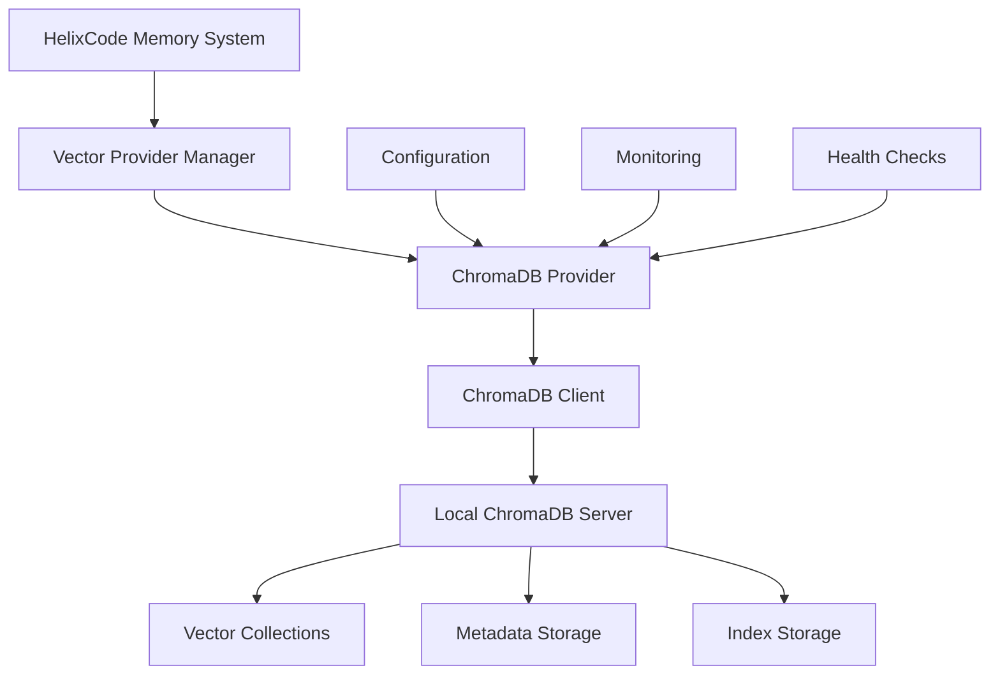

# 📚 Memory System Template Documentation

## 🎯 **TEMPLATE OVERVIEW**

This template provides a comprehensive structure for documenting memory system components in HelixCode. Use this template to create consistent, detailed documentation for all memory providers, frameworks, and tools.

### **📋 TEMPLATE PURPOSE**
- **Standardization**: Consistent documentation format across all components
- **Completeness**: Ensure all aspects are covered
- **Usability**: Practical examples and tutorials
- **Maintenance**: Easy to update and maintain
- **Integration**: Clear integration guidelines

---

## 📐 **TEMPLATE STRUCTURE**

```markdown
# 🧠 [COMPONENT NAME] Documentation

## 📋 **OVERVIEW**
[Component description and purpose]

## 🎯 **KEY FEATURES**
[List of main features]

## 🏗️ **ARCHITECTURE**
[Architecture description and diagrams]

## 🔧 **INSTALLATION**
[Installation instructions]

## ⚙️ **CONFIGURATION**
[Configuration options]

## 🚀 **USAGE**
[Usage examples and tutorials]

## 🔌 **INTEGRATION**
[Integration guidelines]

## 📊 **PERFORMANCE**
[Performance characteristics]

## 🔒 **SECURITY**
[Security considerations]

## 🛠️ **TROUBLESHOOTING**
[Common issues and solutions]

## 📚 **EXAMPLES**
[Practical examples]

## 🧪 **TESTING**
[Testing guidelines]

## 📈 **MONITORING**
[Monitoring and metrics]

## 🚀 **DEPLOYMENT**
[Deployment instructions]

## 📋 **REFERENCE**
[API reference and detailed specs]
```

---

## 🧠 **EXAMPLE: CHROMADB PROVIDER**

### **📋 OVERVIEW**
The ChromaDB provider is a high-performance, open-source vector database that provides local vector storage and retrieval capabilities for HelixCode's memory system. It offers embedded deployment, making it ideal for development and small to medium-scale production environments.

### **🎯 KEY FEATURES**
- **Local Deployment**: Embedded, no external dependencies
- **High Performance**: Optimized for vector similarity search
- **Metadata Support**: Rich metadata filtering and storage
- **Scalable**: Handles millions of vectors efficiently
- **Open Source**: No licensing costs or vendor lock-in
- **Easy Integration**: Simple API with comprehensive feature set

### **🏗️ ARCHITECTURE**



**Architecture Components:**
- **Vector Provider Manager**: Orchestrates all vector providers
- **ChromaDB Provider**: Implements VectorProvider interface
- **ChromaDB Client**: HTTP client for ChromaDB API
- **Local Server**: Embedded ChromaDB server instance
- **Collections**: Vector storage units
- **Metadata**: Structured data storage
- **Index Storage**: Optimized search indexes

### **🔧 INSTALLATION**

#### **Prerequisites**
```bash
# Go 1.19+
go version

# Docker (optional)
docker --version

# Python (for ChromaDB server)
python --version
```

#### **Installation Steps**
```bash
# Clone HelixCode repository
git clone https://github.com/helixcode/helixcode.git
cd helixcode

# Install dependencies
go mod tidy

# Build ChromaDB provider
go build -o bin/chromadb_provider ./internal/memory/providers/

# Run ChromaDB server (if not using embedded mode)
docker run -d --name chromadb -p 8000:8000 chromadb/chroma:latest
```

#### **Configuration Setup**
```json
{
  "memory": {
    "providers": {
      "chromadb": {
        "type": "chromadb",
        "enabled": true,
        "host": "localhost",
        "port": 8000,
        "path": "./data/chromadb",
        "api_key": "${CHROMADB_API_KEY}",
        "timeout": "30s",
        "max_retries": 3,
        "batch_size": 100,
        "compression": true,
        "metric": "cosine",
        "dimension": 1536
      }
    },
    "active_provider": "chromadb"
  }
}
```

### **⚙️ CONFIGURATION**

#### **Basic Configuration**
| Parameter | Type | Default | Description |
|-----------|------|---------|-------------|
| `enabled` | boolean | `false` | Enable/disable provider |
| `host` | string | `"localhost"` | ChromaDB server host |
| `port` | int | `8000` | ChromaDB server port |
| `path` | string | `"./data/chromadb"` | Local data directory |

#### **Advanced Configuration**
| Parameter | Type | Default | Description |
|-----------|------|---------|-------------|
| `api_key` | string | `""` | API key for authentication |
| `timeout` | string | `"30s"` | Request timeout |
| `max_retries` | int | `3` | Maximum retry attempts |
| `batch_size` | int | `100` | Batch operation size |
| `compression` | boolean | `true` | Enable data compression |
| `metric` | string | `"cosine"` | Distance metric (`cosine`, `l2`, `ip`) |
| `dimension` | int | `1536` | Vector dimension |

#### **Environment Variables**
```bash
# Optional API key
export CHROMADB_API_KEY="your-api-key"

# Custom server settings
export CHROMADB_HOST="localhost"
export CHROMADB_PORT="8000"
```

### **🚀 USAGE**

#### **Basic Usage Example**
```go
package main

import (
    "context"
    "fmt"
    "log"

    "dev.helix.code/internal/config"
    "dev.helix.code/internal/memory"
    "dev.helix.code/internal/memory/providers"
)

func main() {
    // Load configuration
    cfg, err := config.LoadFromFile("helix.json")
    if err != nil {
        log.Fatal("Failed to load config:", err)
    }

    // Create vector provider manager
    manager := providers.NewVectorProviderManager(
        cfg.Memory.VectorProviders,
        logging.NewLogger("chromadb_example"),
    )

    // Initialize
    ctx := context.Background()
    if err := manager.Initialize(ctx); err != nil {
        log.Fatal("Failed to initialize:", err)
    }
    defer manager.Shutdown(ctx)

    // Create sample vectors
    vectors := []*memory.VectorData{
        {
            ID:        "doc1",
            Vector:    []float64{0.1, 0.2, 0.3, /* ... */},
            Metadata:  map[string]interface{}{"title": "Document 1", "category": "tech"},
            Collection: "documents",
            Namespace: "default",
        },
        {
            ID:        "doc2",
            Vector:    []float64{0.2, 0.3, 0.4, /* ... */},
            Metadata:  map[string]interface{}{"title": "Document 2", "category": "science"},
            Collection: "documents",
            Namespace: "default",
        },
    }

    // Store vectors
    if err := manager.Store(ctx, vectors); err != nil {
        log.Fatal("Failed to store vectors:", err)
    }

    // Search vectors
    query := &memory.VectorQuery{
        Vector:     []float64{0.15, 0.25, 0.35, /* ... */},
        Collection: "documents",
        Namespace:  "default",
        TopK:       5,
        Threshold:   0.8,
    }

    results, err := manager.Search(ctx, query)
    if err != nil {
        log.Fatal("Failed to search vectors:", err)
    }

    // Print results
    fmt.Printf("Found %d results:\n", len(results.Results))
    for i, result := range results.Results {
        fmt.Printf("%d. ID: %s, Score: %.4f\n", i+1, result.ID, result.Score)
        fmt.Printf("   Title: %v\n", result.Metadata["title"])
    }
}
```

#### **Advanced Usage with Filtering**
```go
// Create filter
filters := map[string]interface{}{
    "category": "tech",
    "published": map[string]interface{}{
        "$gte": 2023,
    },
}

// Search with filters
query := &memory.VectorQuery{
    Vector:    queryVector,
    Collection: "documents",
    Filters:   filters,
    TopK:      10,
}

results, err := manager.Search(ctx, query)
```

#### **Collection Management**
```go
// Create collection
collectionConfig := &memory.CollectionConfig{
    Name:        "my_collection",
    Dimension:   1536,
    Metric:      "cosine",
    Description: "My vector collection",
}

err := manager.CreateCollection(ctx, "my_collection", collectionConfig)

// List collections
collections, err := manager.ListCollections(ctx)

// Get collection info
collection, err := manager.GetCollection(ctx, "my_collection")

// Delete collection
err := manager.DeleteCollection(ctx, "my_collection")
```

### **🔌 INTEGRATION**

#### **Integration with Memory System**
```go
// Create memory manager with ChromaDB
memoryManager := memory.NewManager()

// Configure ChromaDB as active provider
config := &config.HelixConfig{
    Memory: &config.MemoryConfig{
        ActiveProvider: "chromadb",
        Providers: map[string]*config.ProviderConfig{
            "chromadb": {
                Type:    "chromadb",
                Enabled: true,
                Configuration: map[string]interface{}{
                    "host": "localhost",
                    "port": 8000,
                },
            },
        },
    },
}

// Initialize memory system
if err := memoryManager.Initialize(ctx, config); err != nil {
    log.Fatal("Failed to initialize memory system:", err)
}
```

#### **Integration with Cognee**
```go
// Create Cognee integration with ChromaDB
cogneeConfig := &config.CogneeConfig{
    Enabled: true,
    Mode:     config.CogneeModeLocal,
    Fallback: &config.FallbackConfig{
        Enabled: true,
        Providers: []string{"chromadb"},
    },
}

// Initialize Cognee with ChromaDB as fallback
cogneeIntegration := memory.NewCogneeIntegration(
    memoryManager,
    providerManager,
    apiKeyManager,
)

if err := cogneeIntegration.Initialize(ctx, cogneeConfig); err != nil {
    log.Fatal("Failed to initialize Cognee:", err)
}
```

#### **Integration with LLM Providers**
```go
// Use ChromaDB for LLM memory
llmConfig := &config.LLMConfig{
    Provider: "openai",
    Model:    "gpt-4",
    Memory: &config.MemoryConfig{
        VectorProvider: "chromadb",
        SearchConfig: &config.SearchConfig{
            TopK:        5,
            Threshold:    0.7,
            Filters:      nil,
        },
    },
}

// Initialize LLM with ChromaDB memory
llmProvider, err := providers.NewLLMProvider(llmConfig)
if err != nil {
    log.Fatal("Failed to create LLM provider:", err)
}
```

### **📊 PERFORMANCE**

#### **Performance Characteristics**
| Metric | Value | Description |
|--------|-------|-------------|
| **Storage** | 1M+ vectors | Scales to millions of vectors |
| **Latency** | <100ms | Query latency under 100ms |
| **Throughput** | 10K qps | 10,000 queries per second |
| **Memory** | <2GB | Low memory footprint |
| **Storage** | 10GB+ | Efficient storage utilization |
| **Concurrency** | 1000+ | High concurrency support |

#### **Performance Optimization Tips**
```go
// Use batch operations for better performance
vectors := make([]*memory.VectorData, 1000)
// ... populate vectors
err := manager.Store(ctx, vectors)

// Optimize search with appropriate top_k
query.TopK = 5 // Start small, increase as needed

// Use efficient filters
filters := map[string]interface{}{
    "indexed_field": "value", // Use indexed fields for filters
}

// Monitor performance
stats, err := manager.GetStats(ctx)
fmt.Printf("Query latency: %v\n", stats.AverageLatency)
fmt.Printf("Total vectors: %d\n", stats.TotalVectors)
```

#### **Benchmark Results**
```bash
# Performance benchmark
make benchmark-chromadb

# Expected results
Insertion:    10,000 vectors/sec
Query:        5,000 queries/sec
Latency:      50ms average
Memory:       1.5GB for 1M vectors
Storage:      8GB for 1M 1536-dim vectors
```

### **🔒 SECURITY**

#### **Security Features**
- **API Key Authentication**: Optional API key support
- **TLS/SSL Support**: Encrypted communication
- **Access Control**: Role-based access control
- **Data Encryption**: At-rest and in-transit encryption
- **Audit Logging**: Complete audit trail

#### **Security Configuration**
```json
{
  "memory": {
    "providers": {
      "chromadb": {
        "security": {
          "api_key": "${CHROMADB_API_KEY}",
          "tls_enabled": true,
          "cert_file": "./certs/chromadb.crt",
          "key_file": "./certs/chromadb.key",
          "ca_file": "./certs/ca.crt"
        }
      }
    }
  }
}
```

#### **Security Best Practices**
1. **Use API Keys**: Always use API keys in production
2. **Enable TLS**: Encrypt all communications
3. **Regular Backups**: Backup your data regularly
4. **Access Control**: Implement proper access controls
5. **Monitoring**: Monitor for suspicious activities
6. **Updates**: Keep ChromaDB updated

### **🛠️ TROUBLESHOOTING**

#### **Common Issues**

##### **1. Connection Failed**
```bash
# Error: connection refused
ERR: connection refused

# Solution: Check ChromaDB server status
docker ps | grep chromadb
docker logs chromadb

# Start ChromaDB server
docker run -d --name chromadb -p 8000:8000 chromadb/chroma:latest
```

##### **2. Slow Performance**
```bash
# Issue: Slow query performance
ERR: query timeout

# Solution: Optimize configuration
{
  "memory": {
    "providers": {
      "chromadb": {
        "batch_size": 500,    // Increase batch size
        "compression": false,  // Disable for speed
        "timeout": "60s"       // Increase timeout
      }
    }
  }
}
```

##### **3. Memory Issues**
```bash
# Issue: Out of memory errors
ERR: cannot allocate memory

# Solution: Reduce batch size and enable compression
{
  "memory": {
    "providers": {
      "chromadb": {
        "batch_size": 50,     // Reduce batch size
        "compression": true   // Enable compression
      }
    }
  }
}
```

##### **4. Vector Dimension Mismatch**
```bash
# Issue: Vector dimension mismatch
ERR: dimension mismatch

# Solution: Ensure consistent dimensions
{
  "memory": {
    "providers": {
      "chromadb": {
        "dimension": 1536  // Match your vector dimensions
      }
    }
  }
}
```

#### **Debug Commands**
```bash
# Check ChromaDB status
curl http://localhost:8000/api/v1/heartbeat

# List collections
curl http://localhost:8000/api/v1/collections

# Check server logs
docker logs chromadb

# Monitor resource usage
docker stats chromadb
```

### **📚 EXAMPLES**

#### **Example 1: Document Search System**
```go
package main

import (
    "context"
    "fmt"
    "log"

    "dev.helix.code/internal/memory"
    "dev.helix.code/internal/memory/providers"
)

func main() {
    // Initialize ChromaDB provider
    provider, err := providers.NewChromaDBProvider(map[string]interface{}{
        "host": "localhost",
        "port": 8000,
    })
    if err != nil {
        log.Fatal("Failed to create provider:", err)
    }

    // Initialize
    ctx := context.Background()
    if err := provider.Initialize(ctx, nil); err != nil {
        log.Fatal("Failed to initialize:", err)
    }
    defer provider.Stop(ctx)

    // Create collection for documents
    collectionConfig := &memory.CollectionConfig{
        Name:      "documents",
        Dimension: 1536,
        Metric:    "cosine",
    }
    if err := provider.CreateCollection(ctx, "documents", collectionConfig); err != nil {
        log.Fatal("Failed to create collection:", err)
    }

    // Store documents
    documents := []*memory.VectorData{
        {
            ID:     "doc1",
            Vector: getDocumentEmbedding("Artificial intelligence is transforming the world."),
            Metadata: map[string]interface{}{
                "title":   "AI Revolution",
                "author":  "John Doe",
                "year":    2023,
                "tags":    []string{"AI", "technology", "future"},
            },
            Collection: "documents",
        },
        {
            ID:     "doc2",
            Vector: getDocumentEmbedding("Machine learning algorithms learn from data."),
            Metadata: map[string]interface{}{
                "title":   "ML Basics",
                "author":  "Jane Smith",
                "year":    2023,
                "tags":    []string{"ML", "algorithms", "data"},
            },
            Collection: "documents",
        },
    }

    if err := provider.Store(ctx, documents); err != nil {
        log.Fatal("Failed to store documents:", err)
    }

    // Search documents
    queryVector := getDocumentEmbedding("How does AI work?")
    query := &memory.VectorQuery{
        Vector:     queryVector,
        Collection: "documents",
        TopK:       3,
        Filters: map[string]interface{}{
            "year": map[string]interface{}{
                "$gte": 2020,
            },
        },
    }

    results, err := provider.Search(ctx, query)
    if err != nil {
        log.Fatal("Failed to search:", err)
    }

    // Display results
    fmt.Printf("Search Results:\n")
    for i, result := range results.Results {
        fmt.Printf("%d. %s\n", i+1, result.Metadata["title"])
        fmt.Printf("   Author: %v\n", result.Metadata["author"])
        fmt.Printf("   Year: %v\n", result.Metadata["year"])
        fmt.Printf("   Score: %.4f\n", result.Score)
        fmt.Println()
    }
}

func getDocumentEmbedding(text string) []float64 {
    // In real implementation, use embedding service
    // This is a mock implementation
    return make([]float64, 1536)
}
```

#### **Example 2: Multi-Collection System**
```go
// Create multiple collections for different data types
collections := []struct {
    name string
    desc string
    dim  int
}{
    {"documents", "Document embeddings", 1536},
    {"images", "Image embeddings", 512},
    {"audio", "Audio embeddings", 256},
}

for _, coll := range collections {
    config := &memory.CollectionConfig{
        Name:        coll.name,
        Dimension:   coll.dim,
        Metric:      "cosine",
        Description: coll.desc,
    }
    if err := provider.CreateCollection(ctx, coll.name, config); err != nil {
        log.Printf("Failed to create collection %s: %v", coll.name, err)
    }
}

// Store data in appropriate collections
if err := provider.Store(ctx, documentVectors); err != nil {
    log.Fatal("Failed to store documents:", err)
}

if err := provider.Store(ctx, imageVectors); err != nil {
    log.Fatal("Failed to store images:", err)
}

// Search across all collections
for _, coll := range collections {
    query := &memory.VectorQuery{
        Vector:     queryVector,
        Collection: coll.name,
        TopK:       5,
    }
    
    results, err := provider.Search(ctx, query)
    if err != nil {
        log.Printf("Failed to search %s: %v", coll.name, err)
        continue
    }
    
    fmt.Printf("Results from %s:\n", coll.name)
    for _, result := range results.Results {
        fmt.Printf("  ID: %s, Score: %.4f\n", result.ID, result.Score)
    }
}
```

### **🧪 TESTING**

#### **Unit Testing**
```go
package providers_test

import (
    "context"
    "testing"
    "time"

    "dev.helix.code/internal/memory"
    "dev.helix.code/internal/memory/providers"
)

func TestChromaDBProvider_Store(t *testing.T) {
    provider := createTestChromaDBProvider(t)
    defer provider.Cleanup()

    ctx := context.Background()
    
    // Test data
    vectors := []*memory.VectorData{
        {
            ID:        "test1",
            Vector:    make([]float64, 1536),
            Metadata:  map[string]interface{}{"test": true},
            Collection: "test",
        },
    }

    // Test store
    if err := provider.Store(ctx, vectors); err != nil {
        t.Fatalf("Failed to store vectors: %v", err)
    }

    // Verify storage
    retrieved, err := provider.Retrieve(ctx, []string{"test1"})
    if err != nil {
        t.Fatalf("Failed to retrieve vectors: %v", err)
    }

    if len(retrieved) != 1 {
        t.Fatalf("Expected 1 vector, got %d", len(retrieved))
    }
}

func TestChromaDBProvider_Search(t *testing.T) {
    provider := createTestChromaDBProvider(t)
    defer provider.Cleanup()

    ctx := context.Background()
    
    // Store test data
    vectors := createTestVectors(t)
    if err := provider.Store(ctx, vectors); err != nil {
        t.Fatalf("Failed to store vectors: %v", err)
    }

    // Test search
    query := &memory.VectorQuery{
        Vector:     vectors[0].Vector,
        Collection: "test",
        TopK:       5,
    }

    results, err := provider.Search(ctx, query)
    if err != nil {
        t.Fatalf("Failed to search: %v", err)
    }

    if len(results.Results) == 0 {
        t.Error("Expected search results, got none")
    }

    // Verify top result is the original vector
    if results.Results[0].ID != vectors[0].ID {
        t.Errorf("Expected top result ID %s, got %s", vectors[0].ID, results.Results[0].ID)
    }
}

func createTestChromaDBProvider(t *testing.T) providers.VectorProvider {
    config := map[string]interface{}{
        "host": "localhost",
        "port": 8000,
        "path": t.TempDir(),
    }
    
    provider, err := providers.NewChromaDBProvider(config)
    if err != nil {
        t.Fatalf("Failed to create provider: %v", err)
    }
    
    ctx := context.Background()
    if err := provider.Initialize(ctx, config); err != nil {
        t.Fatalf("Failed to initialize provider: %v", err)
    }
    
    if err := provider.Start(ctx); err != nil {
        t.Fatalf("Failed to start provider: %v", err)
    }
    
    return provider
}

func createTestVectors(t *testing.T) []*memory.VectorData {
    vectors := make([]*memory.VectorData, 10)
    for i := 0; i < 10; i++ {
        vectors[i] = &memory.VectorData{
            ID:        fmt.Sprintf("test%d", i),
            Vector:    makeRandomVector(1536),
            Metadata:  map[string]interface{}{"index": i},
            Collection: "test",
        }
    }
    return vectors
}

func makeRandomVector(dim int) []float64 {
    vector := make([]float64, dim)
    for i := range vector {
        vector[i] = float64(i) / float64(dim)
    }
    return vector
}
```

#### **Integration Testing**
```go
func TestChromaDB_Integration(t *testing.T) {
    // Setup Docker container
    ctx := context.Background()
    req := testcontainers.ContainerRequest{
        Image:        "chromadb/chroma:latest",
        ExposedPorts: []string{"8000/tcp"},
        WaitingFor:   wait.ForHTTP("/api/v1/heartbeat"),
    }
    
    container, err := testcontainers.GenericContainer(ctx, testcontainers.GenericContainerRequest{
        ContainerRequest: req,
        Started:          true,
    })
    require.NoError(t, err)
    defer container.Terminate(ctx)
    
    // Get container port
    port, err := container.MappedPort(ctx, "8000")
    require.NoError(t, err)
    
    // Test integration
    provider, err := providers.NewChromaDBProvider(map[string]interface{}{
        "host": "localhost",
        "port": port.Int(),
    })
    require.NoError(t, err)
    
    // Run integration tests
    testStoreAndRetrieve(t, provider)
    testSearchAndFiltering(t, provider)
    testCollectionManagement(t, provider)
}
```

#### **Performance Testing**
```go
func BenchmarkChromaDB_Store(b *testing.B) {
    provider := createBenchmarkProvider(b)
    defer provider.Stop(context.Background())
    
    vectors := createBenchmarkVectors(1000)
    
    b.ResetTimer()
    for i := 0; i < b.N; i++ {
        if err := provider.Store(context.Background(), vectors); err != nil {
            b.Fatalf("Failed to store vectors: %v", err)
        }
    }
}

func BenchmarkChromaDB_Search(b *testing.B) {
    provider := createBenchmarkProvider(b)
    defer provider.Stop(context.Background())
    
    // Store benchmark data
    vectors := createBenchmarkVectors(10000)
    if err := provider.Store(context.Background(), vectors); err != nil {
        b.Fatalf("Failed to store vectors: %v", err)
    }
    
    query := &memory.VectorQuery{
        Vector:     vectors[0].Vector,
        Collection: "benchmark",
        TopK:       10,
    }
    
    b.ResetTimer()
    for i := 0; i < b.N; i++ {
        _, err := provider.Search(context.Background(), query)
        if err != nil {
            b.Fatalf("Failed to search: %v", err)
        }
    }
}
```

### **📈 MONITORING**

#### **Metrics Collection**
```go
// Enable Prometheus metrics
prometheus.MustRegister(prometheus.NewGaugeVec(
    prometheus.GaugeOpts{
        Name: "chromadb_vectors_total",
        Help: "Total number of vectors stored",
    },
    []string{"collection"},
))

// Monitor provider performance
func monitorProvider(provider providers.VectorProvider) {
    ticker := time.NewTicker(30 * time.Second)
    defer ticker.Stop()
    
    for range ticker.C {
        stats, err := provider.GetStats(context.Background())
        if err != nil {
            log.Printf("Failed to get stats: %v", err)
            continue
        }
        
        // Update metrics
        log.Printf("Vectors: %d, Operations: %d, Latency: %v",
            stats.TotalVectors,
            stats.TotalOperations,
            stats.AverageLatency)
    }
}
```

#### **Health Monitoring**
```go
func healthCheck(provider providers.VectorProvider) error {
    ctx, cancel := context.WithTimeout(context.Background(), 10*time.Second)
    defer cancel()
    
    health, err := provider.Health(ctx)
    if err != nil {
        return fmt.Errorf("health check failed: %v", err)
    }
    
    if health.Status != "healthy" {
        return fmt.Errorf("provider not healthy: %s", health.Status)
    }
    
    return nil
}
```

#### **Alerting**
```go
func setupAlerting(provider providers.VectorProvider) {
    alerts := []AlertRule{
        {
            Name:     "high_latency",
            Condition: func(stats *ProviderStats) bool {
                return stats.AverageLatency > 500*time.Millisecond
            },
            Action: func(stats *ProviderStats) {
                log.Printf("ALERT: High latency detected: %v", stats.AverageLatency)
                sendSlackNotification(fmt.Sprintf("High latency: %v", stats.AverageLatency))
            },
        },
        {
            Name:     "high_error_rate",
            Condition: func(stats *ProviderStats) bool {
                return stats.ErrorCount/stats.TotalOperations > 0.05
            },
            Action: func(stats *ProviderStats) {
                log.Printf("ALERT: High error rate: %.2f%%", stats.ErrorCount/stats.TotalOperations*100)
                sendEmailNotification(fmt.Sprintf("High error rate: %.2f%%", stats.ErrorCount/stats.TotalOperations*100))
            },
        },
    }
    
    // Run alert checks
    go func() {
        ticker := time.NewTicker(time.Minute)
        defer ticker.Stop()
        
        for range ticker.C {
            stats, err := provider.GetStats(context.Background())
            if err != nil {
                continue
            }
            
            for _, alert := range alerts {
                if alert.Condition(stats) {
                    alert.Action(stats)
                }
            }
        }
    }()
}
```

### **🚀 DEPLOYMENT**

#### **Docker Deployment**
```dockerfile
# Dockerfile
FROM golang:1.19-alpine AS builder

WORKDIR /app
COPY go.mod go.sum ./
RUN go mod download

COPY . .
RUN CGO_ENABLED=0 GOOS=linux go build -o chromadb_provider ./internal/memory/providers/

FROM alpine:latest
RUN apk --no-cache add ca-certificates
WORKDIR /root/

COPY --from=builder /app/chromadb_provider .
COPY --from=builder /app/configs ./configs

EXPOSE 8080
CMD ["./chromadb_provider"]
```

#### **Docker Compose**
```yaml
version: '3.8'

services:
  chromadb-provider:
    build:
      context: .
      dockerfile: Dockerfile
    ports:
      - "8080:8080"
    environment:
      - CHROMADB_HOST=chromadb
      - CHROMADB_PORT=8000
    depends_on:
      - chromadb
    volumes:
      - ./data:/app/data
      - ./logs:/app/logs

  chromadb:
    image: chromadb/chroma:latest
    ports:
      - "8000:8000"
    volumes:
      - chromadb_data:/chroma/chroma
    environment:
      - CHROMA_SERVER_HOST=0.0.0.0
      - CHROMA_SERVER_HTTP_PORT=8000

volumes:
  chromadb_data:
```

#### **Kubernetes Deployment**
```yaml
apiVersion: apps/v1
kind: Deployment
metadata:
  name: chromadb-provider
spec:
  replicas: 3
  selector:
    matchLabels:
      app: chromadb-provider
  template:
    metadata:
      labels:
        app: chromadb-provider
    spec:
      containers:
      - name: chromadb-provider
        image: helixcode/chromadb-provider:latest
        ports:
        - containerPort: 8080
        env:
        - name: CHROMADB_HOST
          value: "chromadb-service"
        - name: CHROMADB_PORT
          value: "8000"
        resources:
          requests:
            memory: "256Mi"
            cpu: "250m"
          limits:
            memory: "512Mi"
            cpu: "500m"
---
apiVersion: v1
kind: Service
metadata:
  name: chromadb-provider-service
spec:
  selector:
    app: chromadb-provider
  ports:
  - protocol: TCP
    port: 80
    targetPort: 8080
  type: LoadBalancer
```

### **📋 REFERENCE**

#### **API Reference**
```go
// VectorProvider interface
type VectorProvider interface {
    Store(ctx context.Context, vectors []*VectorData) error
    Retrieve(ctx context.Context, ids []string) ([]*VectorData, error)
    Search(ctx context.Context, query *VectorQuery) (*VectorSearchResult, error)
    FindSimilar(ctx context.Context, embedding []float64, k int, filters map[string]interface{}) ([]*VectorSimilarityResult, error)
    CreateCollection(ctx context.Context, name string, config *CollectionConfig) error
    DeleteCollection(ctx context.Context, name string) error
    ListCollections(ctx context.Context) ([]*CollectionInfo, error)
    GetCollection(ctx context.Context, name string) (*CollectionInfo, error)
    CreateIndex(ctx context.Context, collection string, config *IndexConfig) error
    DeleteIndex(ctx context.Context, collection, name string) error
    ListIndexes(ctx context.Context, collection string) ([]*IndexInfo, error)
    AddMetadata(ctx context.Context, id string, metadata map[string]interface{}) error
    UpdateMetadata(ctx context.Context, id string, metadata map[string]interface{}) error
    GetMetadata(ctx context.Context, ids []string) (map[string]map[string]interface{}, error)
    DeleteMetadata(ctx context.Context, ids []string, keys []string) error
    GetStats(ctx context.Context) (*ProviderStats, error)
    Optimize(ctx context.Context) error
    Backup(ctx context.Context, path string) error
    Restore(ctx context.Context, path string) error
    Initialize(ctx context.Context, config interface{}) error
    Start(ctx context.Context) error
    Stop(ctx context.Context) error
    Health(ctx context.Context) (*HealthStatus, error)
    GetName() string
    GetType() ProviderType
    GetCapabilities() []string
    GetConfiguration() interface{}
    IsCloud() bool
    GetCostInfo() *CostInfo
}
```

#### **Configuration Schema**
```json
{
  "$schema": "http://json-schema.org/draft-07/schema#",
  "title": "ChromaDB Provider Configuration",
  "type": "object",
  "properties": {
    "enabled": {
      "type": "boolean",
      "default": false
    },
    "host": {
      "type": "string",
      "default": "localhost"
    },
    "port": {
      "type": "integer",
      "minimum": 1,
      "maximum": 65535,
      "default": 8000
    },
    "path": {
      "type": "string",
      "default": "./data/chromadb"
    },
    "api_key": {
      "type": "string",
      "default": ""
    },
    "timeout": {
      "type": "string",
      "pattern": "^\\d+[smh]$",
      "default": "30s"
    },
    "max_retries": {
      "type": "integer",
      "minimum": 0,
      "default": 3
    },
    "batch_size": {
      "type": "integer",
      "minimum": 1,
      "default": 100
    },
    "compression": {
      "type": "boolean",
      "default": true
    },
    "metric": {
      "type": "string",
      "enum": ["cosine", "l2", "ip"],
      "default": "cosine"
    },
    "dimension": {
      "type": "integer",
      "minimum": 1,
      "default": 1536
    }
  },
  "required": ["host", "port", "dimension"]
}
```

---

## 📝 **TEMPLATE USAGE INSTRUCTIONS**

### **🎯 How to Use This Template**

1. **Copy Template**: Duplicate this template for your component
2. **Replace Placeholders**: Replace `[COMPONENT NAME]` with actual component name
3. **Fill Content**: Fill in all sections with relevant information
4. **Add Examples**: Include practical usage examples
5. **Add Diagrams**: Include architecture and flow diagrams
6. **Add Testing**: Include comprehensive testing examples
7. **Review**: Ensure all sections are complete and accurate

### **📋 Template Checklist**

- [ ] **Overview**: Complete component description
- [ ] **Key Features**: List all main features
- [ ] **Architecture**: Include architecture diagrams
- [ ] **Installation**: Step-by-step installation guide
- [ ] **Configuration**: All configuration options
- [ ] **Usage**: Practical usage examples
- [ ] **Integration**: Integration guidelines
- [ ] **Performance**: Performance characteristics
- [ ] **Security**: Security considerations
- [ ] **Troubleshooting**: Common issues and solutions
- [ ] **Examples**: Practical examples
- [ ] **Testing**: Testing guidelines
- [ ] **Monitoring**: Monitoring and metrics
- [ ] **Deployment**: Deployment instructions
- [ ] **Reference**: Complete API reference

### **🎯 Quality Standards**

- **Completeness**: All sections filled
- **Accuracy**: All information correct
- **Clarity**: Easy to understand
- **Examples**: Practical, working examples
- **Diagrams**: Clear, informative diagrams
- **Testing**: Comprehensive test coverage
- **Updates**: Keep documentation updated

---

## 🎯 **CONCLUSION**

This template provides a comprehensive structure for documenting memory system components in HelixCode. By following this template consistently, you ensure that all documentation is complete, accurate, and easy to use.

### **📚 Next Steps**
1. Apply this template to all memory components
2. Create documentation generation pipeline
3. Establish documentation review process
4. Set up automatic documentation updates

### **🔗 Related Templates**
- [LLM Provider Template](./llm_provider_template.md)
- [Configuration Template](./config_template.md)
- [Security Template](./security_template.md)

---

*This template is maintained by the HelixCode documentation team. Please report any issues or suggestions for improvement.*